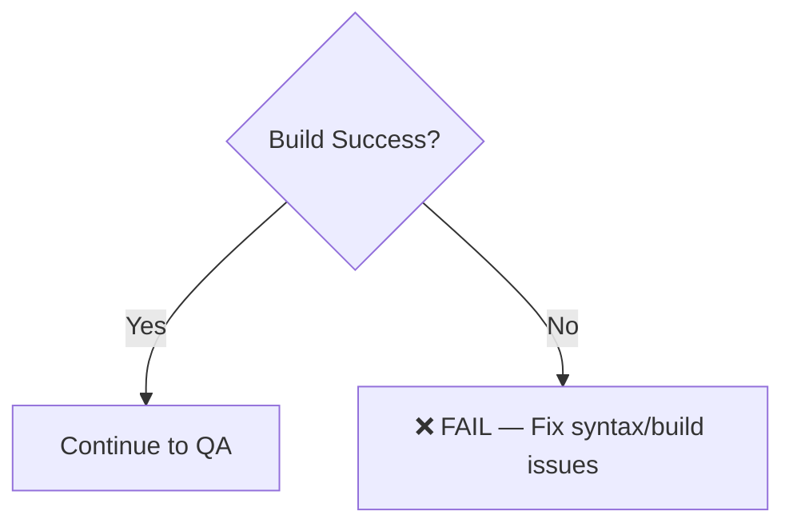
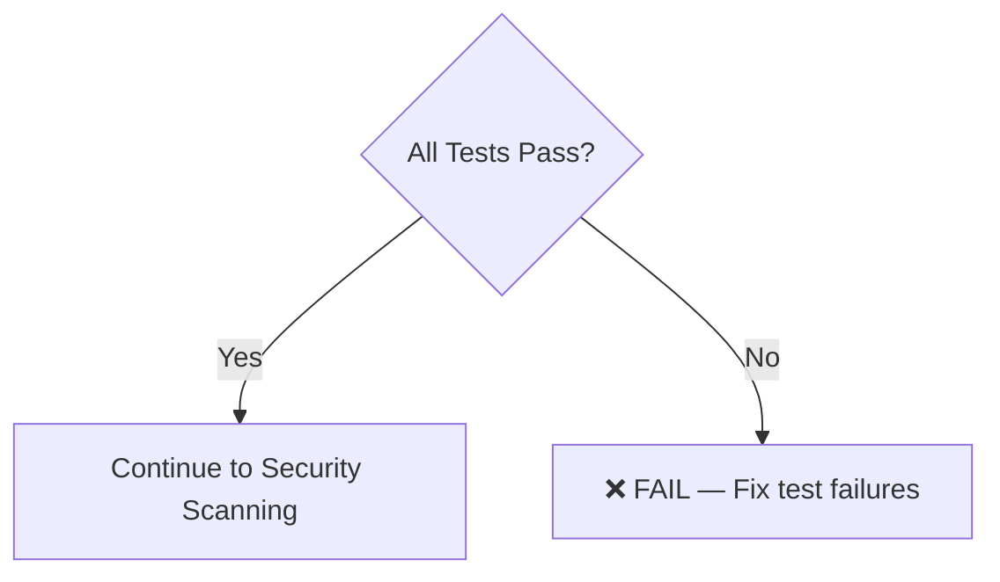
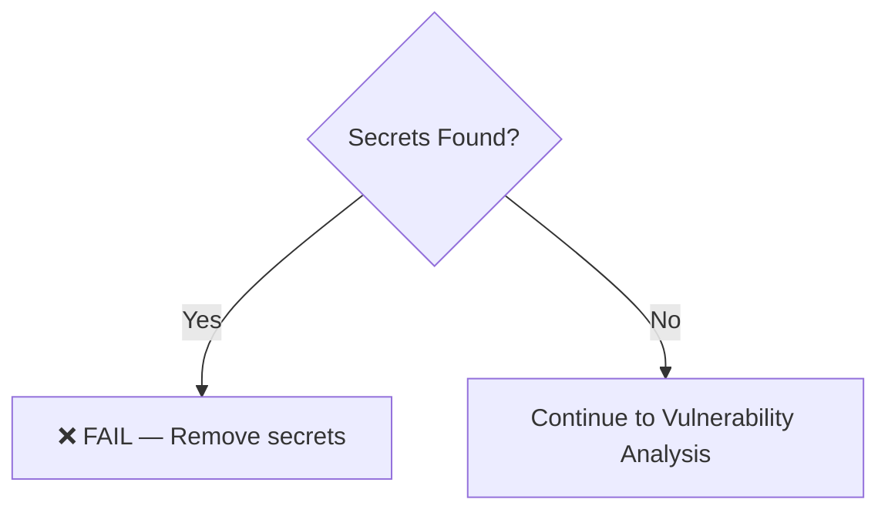
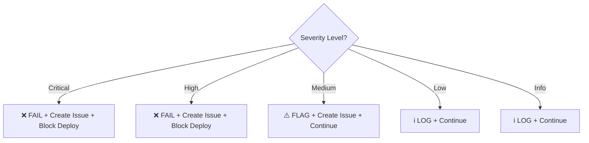
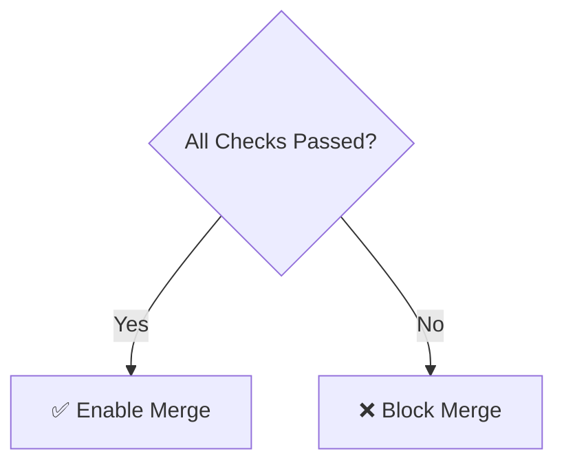
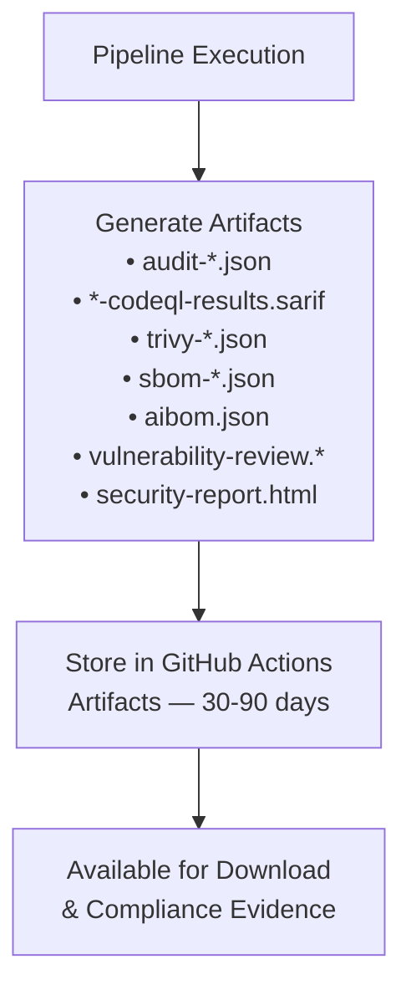
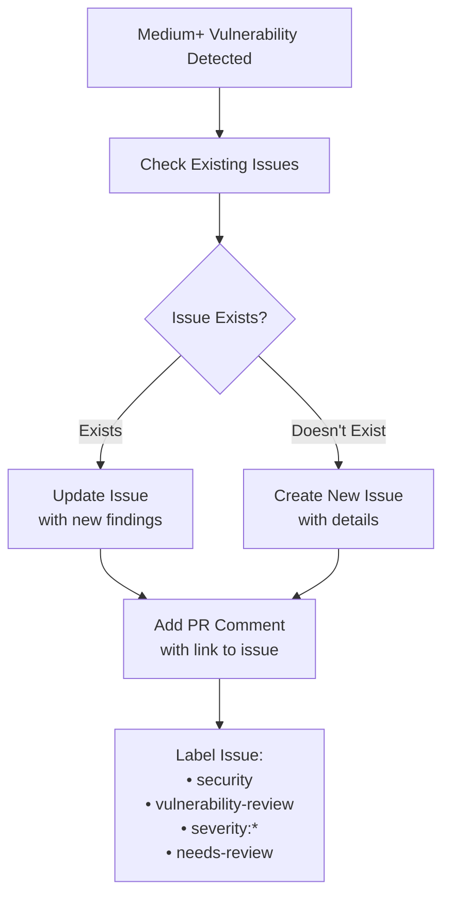
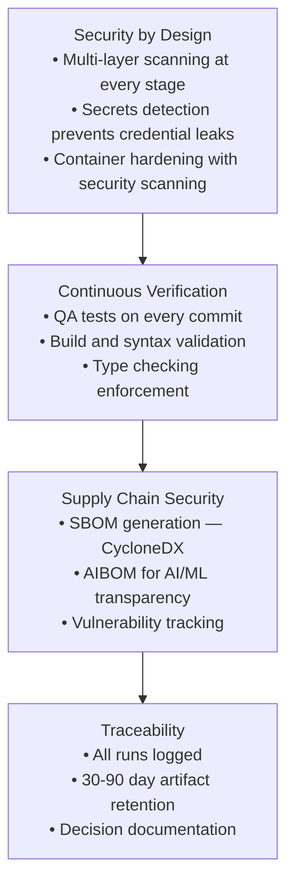

# CI/CD Pipeline Architecture

## Visual Overview

```mermaid
flowchart TD
    trigger(["PULL REQUEST OPENED/UPDATED"])
    trigger --> stage1

    subgraph stage1["Stage 1: Build & Test"]
        direction LR
        BB["Backend Build<br/>• npm install<br/>• Syntax check<br/>• IP hygiene<br/>• Build<br/>• Security audit"]
        FB["Frontend Build<br/>• npm install<br/>• Type check<br/>• Lint<br/>• Build<br/>• Security audit"]
        BB --> BBR["✅ PASS or ❌ FAIL"]
        FB --> FBR["✅ PASS or ❌ FAIL"]
    end

    stage1 --> stage2

    subgraph stage2["Stage 2: QA Testing Suite"]
        QA["PostgreSQL Test Database<br/>• Database migrations<br/>• Syntax validation<br/>• IP hygiene checks<br/>• Dynamic E2E suite<br/>• Crosswalk verification"]
        QA --> QAR["✅ PASS or ❌ FAIL — All tests must pass"]
    end

    stage2 --> stage3

    subgraph stage3["Stage 3: Security Scanning — SAST"]
        direction LR
        CQ["CodeQL Analysis<br/>• JS/TS<br/>• Security<br/>• Quality<br/>• CVE"]
        DS["Dependency Scanning<br/>• npm audit<br/>• Backend<br/>• Frontend"]
        SD["Secrets Detection<br/>• TruffleHog<br/>• Gitleaks"]
        CS["Container Security<br/>• Trivy<br/>• Backend<br/>• Frontend"]
        CQ --> CQF["Findings"]
        DS --> DSF["Findings"]
        SD --> SDF["Findings"]
        CS --> CSF["Findings"]
    end

    stage3 --> stage4

    subgraph stage4["Stage 4: SBOM & AIBOM Generation"]
        direction LR
        SBOM["SBOM Generation<br/>• CycloneDX format<br/>• Backend dependencies<br/>• Frontend dependencies<br/>• 90-day retention"]
        AIBOM["AIBOM Generation<br/>• AI/ML dependencies<br/>• LLM providers<br/>• Model documentation<br/>• Compliance mapping"]
        SBOM --> SBOMF["sbom-*.json"]
        AIBOM --> AIBOMF["aibom.json"]
    end

    stage4 --> stage5

    subgraph stage5["Stage 5: Vulnerability Analysis & Flagging"]
        VA["Analyze All Security Findings"]
        VA --> CRIT["Critical<br/>• Create issue<br/>• BLOCK deploy<br/>• Immediate action"]
        VA --> HIGH["High<br/>• Create issue<br/>• BLOCK deploy<br/>• Fix before merge"]
        VA --> MED["Medium<br/>• Create issue<br/>• FLAG for review<br/>• Document decision"]
        VA --> LOW["Low<br/>• Log only<br/>• No action"]
        VA --> INFO["Info<br/>• Log only<br/>• No action"]
    end

    stage5 --> VR["vulnerability-review.json + GitHub Issues"]
    VR --> decision1{High/Critical?}
    decision1 -->|Yes| fail1["FAIL BUILD — Block Merge"]
    decision1 -->|No| stage6

    subgraph stage6["Stage 6: Security Report Generation"]
        SR["Consolidate All Findings<br/>• CodeQL results<br/>• Dependency vulnerabilities<br/>• Secrets scan results<br/>• Container vulnerabilities<br/>• SBOM/AIBOM data"]
        SR --> SRO["Output: HTML Report + PR Comment"]
    end

    stage6 --> stage7

    subgraph stage7["Stage 7: Final Gate — All Checks"]
        FG["Verify ALL Previous Stages Passed<br/>✅ Backend Build & Test<br/>✅ Frontend Build & Test<br/>✅ QA Testing Suite<br/>✅ CodeQL Analysis<br/>✅ Dependency Scan<br/>✅ Secrets Scan<br/>✅ SBOM Generated<br/>✅ AIBOM Generated<br/>✅ Vulnerability Analysis<br/>✅ Security Report"]
    end

    stage7 --> decision2{All Pass?}
    decision2 -->|Yes| success["✅ SUCCESS — Enable Merge"]
    decision2 -->|No| blocked["❌ BLOCKED — Fix Required"]

    success --> stage8

    subgraph stage8["Stage 8: Deployment — Main Branch Only"]
        DAST["DAST<br/>• Start application containers<br/>• OWASP ZAP baseline scan<br/>• Runtime vulnerability detection"]
        DAST --> DEPLOY["Deploy to Environment<br/>• Push to container registry<br/>• Deploy to staging/production<br/>• Health checks"]
    end

    stage8 --> deployed(["DEPLOYED ✅"])
```

## Parallel Execution

The pipeline is optimized for parallel execution where possible:

```mermaid
gantt
    title Pipeline Parallel Execution Timeline
    dateFormat X
    axisFormat %s

    section Build (0-5 min)
    Backend Build           :b1, 0, 300
    Frontend Build          :b2, 0, 300

    section QA (5-10 min)
    QA Testing              :qa, after b1, 300

    section Security (10-20 min)
    CodeQL                  :s1, after qa, 600
    Dependencies            :s2, after qa, 600
    Secrets                 :s3, after qa, 600
    Containers              :s4, after qa, 600

    section SBOM (20-25 min)
    SBOM Generation         :sb1, after s1, 300
    AIBOM Generation        :sb2, after s1, 300

    section Analysis (25-30 min)
    Vulnerability Analysis  :va, after sb1, 150
    Security Report         :sr, after va, 120
    Final Gate              :crit, fg, after sr, 60
    PASS / FAIL             :milestone, result, after fg, 0
```

## Decision Points

### 1. Build Stage Decision

### 2. QA Testing Decision

### 3. Security Scanning Decision

### 4. Vulnerability Decision (CRITICAL)

### 5. Final Gate Decision

## Artifact Flow

## Issue Creation Flow

## NIST 800-160 Integration Points

---

**Total Pipeline Time:** ~20-35 minutes
**Parallel Jobs:** Up to 6 concurrent
**Quality Gates:** 10 mandatory checks
**Fail Points:** 5 critical decision points
**Artifacts Generated:** 8+ per run
