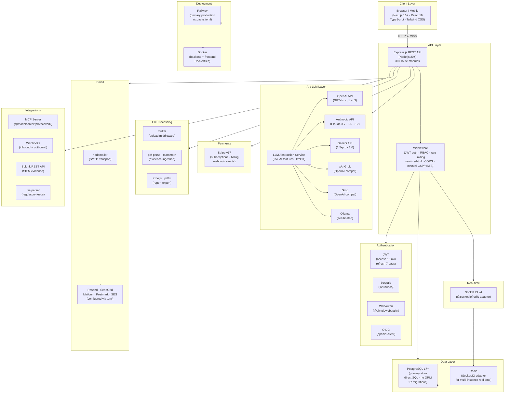

# ControlWeave SaaS Stack

> **TL;DR — Yes, we have the stack.**

This document maps ControlWeave's technology choices against the standard SaaS stack reference ([@hridoyreh on X](https://x.com/hridoyreh)). Every category from the reference is covered below. Each entry shows what ControlWeave uses today and what is on the roadmap.

---

## System Architecture



---

## 📁 SaaS Stack

```
ControlWeave SaaS Stack
|
├── 📁 Frontend
|   ├── React          ✅  (React 19 — via Next.js)
|   ├── Next.js        ✅  (v16+ App Router, TypeScript, SSR/SSG)
|   ├── Vue            ❌  (not used — React/Next.js chosen instead)
|   ├── TailwindCSS    ✅  (utility-first styling throughout)
|   └── Shadcn UI      🔜  (planned component library migration)
|
├── 📁 Backend
|   ├── Node.js        ✅  (20+, primary runtime)
|   ├── Django         ❌  (not used — Node.js/Express chosen instead)
|   ├── Laravel        ❌  (not used — Node.js/Express chosen instead)
|   ├── FastAPI        ❌  (not used — Node.js/Express chosen instead)
|   └── Express        ✅  (REST API — 30+ route modules)
|       └── Hono       🔜  (edge-runtime routes + MCP transport — planned; dependency in place)
|
├── 📁 Database
|   ├── PostgreSQL     ✅  (v17+, primary store — direct SQL, no ORM)
|   ├── MySQL          ❌  (not used — PostgreSQL chosen instead)
|   ├── MongoDB        ❌  (not used — PostgreSQL chosen instead)
|   ├── Redis          ✅  (Socket.IO multi-instance adapter — redis client; ioredis in package.json)
|   └── Supabase       ❌  (not used — self-managed PostgreSQL + custom auth)
|
├── 📁 Auth
|   |   (ControlWeave ships fully custom auth — no third-party vendor needed)
|   ├── Clerk          ❌  (not needed — custom JWT + WebAuthn covers this)
|   ├── Auth0          ❌  (not needed — custom JWT + OIDC covers this)
|   ├── Firebase Auth  ❌  (not needed — custom auth built in)
|   ├── Supabase Auth  ❌  (not needed — custom auth built in)
|   └── NextAuth       ❌  (not needed — custom auth built in)
|       ├── JWT        ✅  (jsonwebtoken — access + refresh token flow, bonus)
|       ├── bcryptjs   ✅  (12 rounds password hashing, bonus)
|       ├── WebAuthn   ✅  (@simplewebauthn — passkey / hardware key support, bonus)
|       └── OIDC       ✅  (openid-client — SSO / federated identity, bonus)
|
├── 📁 Payments
|   ├── Stripe         ✅  (subscriptions, billing, webhooks — stripe v17)
|   ├── Paddle         🔜  (roadmap)
|   ├── Dodo Payments  🔜  (roadmap)
|   ├── Lemon Squeezy  🔜  (roadmap)
|   └── Polar          🔜  (roadmap)
|
├── 📁 Emails
|   |   (nodemailer SMTP transport — swap provider via .env, no code change)
|   ├── Resend         🔌  (set SMTP_HOST=smtp.resend.com)
|   ├── SendGrid       🔌  (set SMTP_HOST=smtp.sendgrid.net)
|   ├── Mailgun        🔌  (set SMTP_HOST=smtp.mailgun.org)
|   ├── Postmark       🔌  (set SMTP_HOST=smtp.postmarkapp.com)
|   └── Amazon SES     🔌  (set SMTP_HOST=email-smtp.<region>.amazonaws.com)
|
├── 📁 Storage
|   ├── AWS S3         🔜  (planned — S3-compatible storage integration)
|   ├── Cloudflare R2  🔜  (planned — S3-compatible object storage)
|   ├── Google Cloud   🔜  (planned — GCS S3-compatible storage)
|   ├── Supabase       ❌  (not used — self-managed storage)
|   └── Uploadcare     🔜  (roadmap)
|       ├── multer     ✅  (local/temp upload middleware, bonus)
|       ├── pdf-parse  ✅  (evidence PDF ingestion, bonus)
|       ├── mammoth    ✅  (DOCX evidence ingestion, bonus)
|       ├── exceljs    ✅  (Excel report export, bonus)
|       └── pdfkit     ✅  (PDF report generation, bonus)
|
├── 📁 Deployment
|   ├── Vercel         🔌  (frontend deployable — next.config.ts is compatible)
|   ├── Netlify        🔌  (Docker-compatible)
|   ├── Railway        ✅  (primary production platform — nixpacks.toml)
|   ├── Render         🔌  (Docker-compatible)
|   └── AWS            🔌  (Docker-compatible — ECS / App Runner)
|
├── 📁 Domains and DNS
|   |   (ControlWeave is infrastructure-agnostic — use any DNS provider)
|   ├── Namecheap      🔌  (point A/CNAME records to Railway / Vercel)
|   ├── Hostinger      🔌  (point A/CNAME records to Railway / Vercel)
|   ├── Cloudflare DNS 🔌  (recommended — proxy + WAF + DDoS protection)
|   ├── Google Domains 🔌  (point A/CNAME records to deployment host)
|   └── SiteGround     🔌  (point A/CNAME records to deployment host)
|
├── 📁 Analytics
|   ├── Google Analytics 🔜  (roadmap — add GA4 tag to Next.js layout)
|   ├── Plausible        🔜  (roadmap — privacy-first, script tag)
|   ├── PostHog          🔜  (roadmap — product analytics + session replay)
|   ├── Mixpanel         🔜  (roadmap)
|   └── DataFast         🔜  (roadmap)
|
├── 📁 Monitoring
|   ├── Sentry         🔜  (roadmap — error tracking, frontend + backend)
|   ├── LogRocket      🔜  (roadmap — session replay)
|   ├── Datadog        🔜  (roadmap — APM + infrastructure metrics)
|   ├── NewRelic       🔜  (roadmap — APM)
|   └── UptimeRobot    🔜  (roadmap — uptime + alerting)
|       └── GitHub Actions ✅  (CI health checks + TEVV test suite, bonus)
|
├── 📁 DevOps
|   ├── Docker         ✅  (Dockerfile for backend + frontend)
|   ├── Kubernetes     🔜  (roadmap — Helm chart planned)
|   └── GitHub Actions ✅  (CI: lint, typecheck, security scan, TEVV suite)
|       └── dependabot ✅  (automated dependency PRs, bonus)
|
├── 📁 Search
|   ├── Algolia        🔜  (roadmap — external search index)
|   ├── Meilisearch    🔜  (roadmap — self-hosted)
|   ├── Elasticsearch  🔜  (roadmap)
|   ├── Typesense      🔜  (roadmap — self-hosted)
|   └── OpenSearch     🔜  (roadmap)
|       └── PostgreSQL search ✅  (ILIKE-based text matching — controls, assets, evidence, bonus)
|           └── PostgreSQL FTS 🔜  (pg_trgm + tsvector — roadmap for relevance-ranked search)
|
├── 📁 AI Integration
|   ├── OpenAI API     ✅  (openai SDK — GPT-4o, o1, o3-mini, etc.)
|   ├── Anthropic API  ✅  (@anthropic-ai/sdk — Claude 3.x / 3.5 / 3.7)
|   ├── Replicate      🔜  (roadmap)
|   ├── HuggingFace    🔜  (roadmap)
|   └── Gemini API     ✅  (Google Gemini REST — gemini-1.5-pro / 2.0)
|       ├── xAI Grok   ✅  (OpenAI-compatible endpoint, bonus)
|       ├── Groq        ✅  (OpenAI-compatible — ultra-fast inference, bonus)
|       └── Ollama      ✅  (self-hosted, OpenAI-compatible — privacy mode, bonus)
|
├── 📁 Integrations
|   ├── Zapier         🔜  (roadmap — outbound webhook triggers)
|   ├── Make           🔜  (roadmap — outbound webhook triggers)
|   ├── n8n            🔜  (roadmap — self-hosted automation)
|   ├── Pabbly         🔜  (roadmap)
|   └── Webhooks       ✅  (inbound + outbound native webhook engine)
|       ├── Splunk     ✅  (Splunk REST API — SIEM evidence ingestion, bonus)
|       ├── RSS        ✅  (rss-parser — regulatory news feeds, bonus)
|       └── MCP server ✅  (@modelcontextprotocol/sdk — Claude Desktop, Cursor, bonus)
|
├── 📁 Security
|   ├── SSL/TLS        ✅  (enforced at platform / reverse-proxy level)
|   ├── Cloudflare     🔌  (recommended CDN + DDoS — configure in DNS)
|   ├── WAF            🔌  (Cloudflare WAF or AWS WAF — infrastructure layer)
|   ├── Rate Limiting  ✅  (express middleware — per-route, configurable)
|   └── Secrets Mgmt   ✅  (dotenv + platform env vars — never committed to git)
|       ├── CORS       ✅  (explicit origin allowlist, bonus)
|       ├── sanitize-html ✅  (XSS sanitization on all user inputs, bonus)
|       └── Zod        ✅  (MCP tool + SDK schema validation, bonus)
|
├── 📁 Marketing
|   ├── Search Console 🔜  (roadmap — add GSC verification meta tag)
|   ├── Outrank        🔜  (roadmap)
|   ├── Buffer         🔜  (roadmap — social scheduling)
|   ├── Analytics      🔜  (see Analytics section above)
|   └── Kit            🔜  (roadmap — email marketing / newsletter)
|
└── 📁 Customer Support
    ├── Intercom       🔜  (roadmap)
    ├── Crisp          🔜  (roadmap — in-app chat widget)
    ├── Zendesk        🔜  (roadmap)
    ├── Tawk           🔜  (roadmap — free live chat option)
    └── HelpScout      🔜  (roadmap)
```

---

## Legend

| Symbol | Meaning |
|--------|---------|
| ✅ | Implemented and in production |
| 🔌 | Plug-in ready — configure via environment variables, no code change |
| 🔜 | On the roadmap — planned but not yet implemented |
| ❌ | Not used — an alternative in the same category covers this |

Items marked **bonus** are ControlWeave capabilities that go beyond the reference stack.

---

## Summary by Category

| Category | Status | Notes |
|----------|--------|-------|
| Frontend | ✅ Full | Next.js 16+, React 19, TypeScript, Tailwind CSS |
| Backend | ✅ Full | Node.js 20+, Express; Hono roadmap |
| Database | ✅ Full | PostgreSQL 17+, Redis |
| Auth | ✅ Full | Custom JWT + bcryptjs + WebAuthn + OIDC (no third-party vendor needed) |
| Payments | ✅ Core | Stripe — subscriptions, billing, webhooks |
| Emails | ✅ Full | nodemailer SMTP — Resend, SendGrid, Mailgun, Postmark, SES via `.env` |
| Storage | 🔜 Roadmap | multer local uploads ✅; S3 / Cloudflare R2 / GCS integrations planned |
| Deployment | ✅ Core | Railway ✅; Vercel / Netlify / Render / AWS plug-in ready |
| Domains and DNS | 🔌 Plug-in | Infrastructure-agnostic — use any DNS provider |
| Analytics | 🔜 Roadmap | PostHog, Plausible, Google Analytics, Mixpanel, DataFast planned |
| Monitoring | 🔜 Roadmap | Sentry, LogRocket, Datadog, NewRelic, UptimeRobot planned |
| DevOps | ✅ Full | Docker, GitHub Actions CI, dependabot; Kubernetes on roadmap |
| Search | ✅ Core | PostgreSQL ILIKE search (controls, assets, evidence, vendors); FTS on roadmap |
| AI Integration | ✅ Full | 6 providers live (OpenAI, Anthropic, Gemini, xAI, Groq, Ollama) |
| Integrations | ✅ Core | Native webhooks ✅; Zapier / Make / n8n roadmap |
| Security | ✅ Full | SSL, Rate Limiting, Secrets Management, CORS, sanitize-html, manually configured security headers (CSP, HSTS, X-Frame-Options) |
| Marketing | 🔜 Roadmap | Search Console, Buffer, Kit, Outrank planned |
| Customer Support | 🔜 Roadmap | Crisp, Intercom, Zendesk, Tawk, HelpScout planned |

---

## Environment Variables for Plug-in Services

The following services are plug-in ready — add the relevant keys to your `.env` to activate them:

```env
# Email providers — nodemailer uses whichever SMTP host you set
SMTP_HOST=smtp.resend.com          # or smtp.sendgrid.net / smtp.mailgun.org / etc.
SMTP_PORT=587
SMTP_USER=resend                   # varies by provider
SMTP_PASS=re_xxxx

# Stripe — already integrated, just add your keys
STRIPE_SECRET_KEY=sk_live_...
STRIPE_WEBHOOK_SECRET=whsec_...

# Redis — already integrated, just point to your instance
REDIS_URL=redis://localhost:6379
```

See [`controlweave/QUICK_START.md`](./controlweave/QUICK_START.md) for the full environment variable reference.
