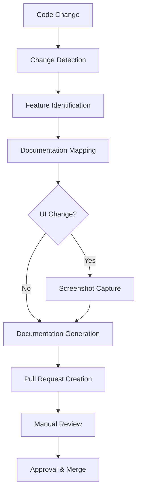
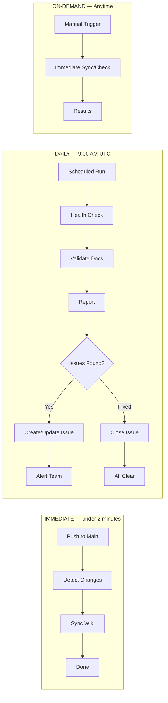
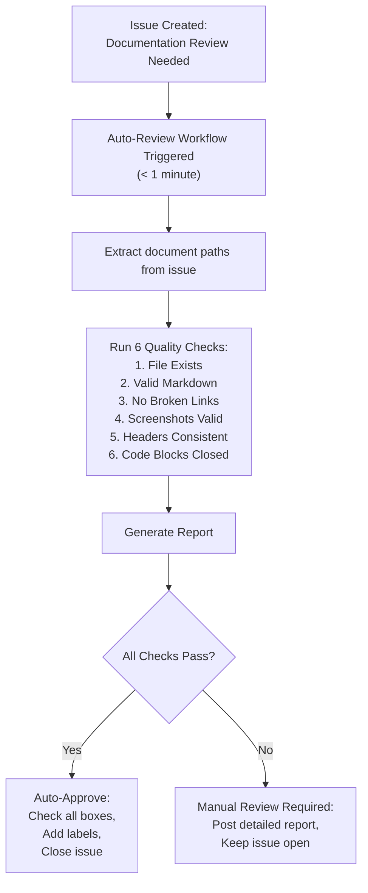
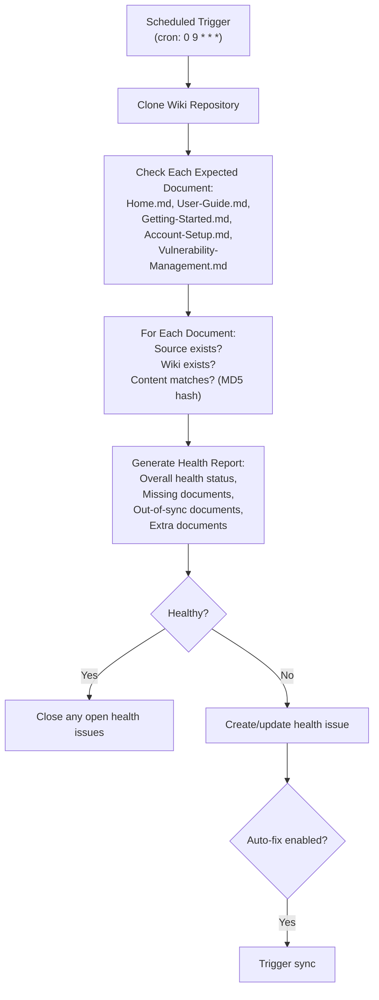
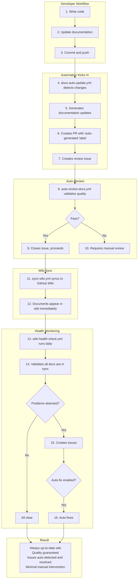
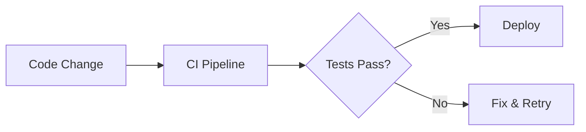

# 📖 ControlWeave Documentation System - Complete Guide

## Overview

This document provides a complete overview of the ControlWeave documentation system, including user guides, automated updates, and maintenance procedures.

## 📚 Documentation Structure

```
controlweave/docs/
├── USER_GUIDE.md                    # Main documentation hub
├── TIER_COMPARISON.md               # Feature availability by tier
├── guides/                          # User guides
│   ├── GETTING_STARTED.md          # First-time user onboarding
│   ├── QUICK_WINS.md               # Quick value in 30 minutes
│   ├── FRAMEWORKS.md               # Framework management
│   ├── CONTROLS.md                 # Control implementation
│   ├── ASSESSMENTS.md              # Assessment execution
│   ├── AI_COPILOT.md               # AI assistant usage
│   ├── AI_ANALYSIS.md              # AI-powered analysis
│   ├── EVIDENCE.md                 # Evidence management
│   ├── CMDB.md                     # Asset management
│   ├── VULNERABILITIES.md          # Vulnerability tracking
│   ├── POAM.md                     # POA&M management
│   ├── AUDITOR_WORKSPACE.md        # External auditor features
│   ├── DASHBOARD.md                # Dashboard usage
│   ├── REPORTS.md                  # Report generation
│   ├── SETTINGS.md                 # Configuration
│   ├── USERS.md                    # User management
│   ├── NOTIFICATIONS.md            # Notification setup
│   ├── SECURITY.md                 # Security features
│   ├── INTEGRATIONS.md             # External integrations
│   └── FAQ.md                      # Common questions
├── screenshots/                     # Visual guides
│   ├── README.md                   # Screenshot guidelines
│   └── *.png                       # Screenshot files
├── best-practices/                  # Best practice guides
│   ├── GRC_BEST_PRACTICES.md       # General GRC guidance
│   ├── EVIDENCE_COLLECTION.md      # Evidence tips
│   ├── ASSESSMENT_STRATEGIES.md    # Assessment approaches
│   └── AI_USAGE.md                 # AI usage guidelines
├── frameworks/                      # Framework-specific guides
│   ├── NIST_800_53.md             # NIST 800-53 guide
│   ├── ISO_27001.md               # ISO 27001 guide
│   ├── SOC2.md                    # SOC 2 guide
│   ├── GDPR.md                    # GDPR guide
│   └── HIPAA.md                   # HIPAA guide
└── integrations/                    # Integration guides
    ├── SPLUNK.md                   # Splunk integration
    ├── SSO.md                      # SSO/SAML setup
    ├── API_DOCS.md                 # API documentation
    └── WEBHOOKS.md                 # Webhook configuration
```

## 🤖 Automated Documentation System

### Key Components

**1. GitHub Actions Workflow**
- File: `.github/workflows/docs-auto-update.yml`
- Triggers on code changes to features
- Automatically creates documentation PRs

**2. Feature Mapping**
- File: `.github/feature-docs-map.json`
- Maps code files to documentation
- Defines screenshot requirements

**3. Detection Script**
- File: `.github/scripts/detect-feature-changes.js`
- Analyzes git diffs
- Identifies affected features

**4. Screenshot Automation**
- File: `.github/scripts/capture-screenshots.js`
- Uses Playwright for UI capture
- Automatically saves to screenshots directory

**5. Documentation Generator**
- File: `.github/scripts/generate-doc-updates.js`
- Generates markdown updates
- Applies templates for consistency

### Automation Flow



### Check Frequency



### Auto-Review Flow

When a documentation review issue is filed, `auto-review-docs.yml` validates the changed
documents against six quality checks and either auto-approves or flags for manual review:



### Health Check Flow

`wiki-health-check.yml` runs on the daily schedule above and reconciles the published wiki
against source documentation:



### Complete Workflow Integration

The pieces above chain together end to end, from a developer's code change through to a
verified, published wiki page:



## 📸 Screenshot System

### Naming Convention

```
<feature>-<action>-<sequence>.png
```

Examples:
- `dashboard-overview-01.png`
- `controls-edit-implementation-01.png`
- `ai-copilot-chat-interface-01.png`

### Quality Standards

- **Resolution**: 1920x1080
- **Format**: PNG
- **Size**: < 500KB (optimized)
- **Content**: Realistic data, clean UI
- **Annotations**: Red arrows/boxes for highlights

### Capture Process

1. **Automatic**: Triggered by UI changes
2. **Manual**: Use screenshot capture script
3. **Review**: Verify quality and relevance
4. **Optimize**: Compress for web delivery

## 📐 Diagrams

We use [Mermaid](https://github.com/mermaid-js/mermaid) for all diagrams in documentation. Mermaid renders natively on GitHub — no plugins or build steps required.

### When to Use Diagrams

- Architecture overviews and system boundaries
- Data flows and sequence diagrams
- Decision trees and flowcharts
- Entity relationships and class hierarchies
- CI/CD pipeline stages
- State machines and user journeys

### Syntax

Wrap diagrams in a fenced code block with the `mermaid` language identifier:

````markdown

````

### Supported Diagram Types

| Type | Directive | Use Case |
|------|-----------|----------|
| Flowchart | `flowchart LR` / `flowchart TD` | Processes, pipelines, decision trees |
| Sequence | `sequenceDiagram` | API calls, request/response flows |
| Class | `classDiagram` | Data models, entity relationships |
| State | `stateDiagram-v2` | Lifecycle states, status transitions |
| ER | `erDiagram` | Database schema relationships |
| Gantt | `gantt` | Timelines, roadmaps |
| Pie | `pie` | Distribution breakdowns |

### Example: Automation Flow


### Guidelines

- **Keep diagrams focused** — one concept per diagram, split complex flows into multiple diagrams
- **Use descriptive node labels** — `[CI Pipeline]` not `[B]`
- **Choose direction wisely** — `LR` (left-to-right) for pipelines, `TD` (top-down) for hierarchies
- **Prefer Mermaid over ASCII art** for new diagrams — existing ASCII diagrams can be migrated incrementally
- **Test rendering** by previewing on GitHub before merging

### Resources

- [Mermaid documentation](https://mermaid.js.org/intro/)
- [Mermaid live editor](https://mermaid.live/) — prototype diagrams before committing
- [GitHub Mermaid support](https://docs.github.com/en/get-started/writing-on-github/working-with-advanced-formatting/creating-diagrams)

## 🎯 Documentation for Different Audiences

### For New Users
**Start Here:**
1. [Getting Started Guide](guides/GETTING_STARTED.md) - 30-minute onboarding
2. [Quick Wins Guide](guides/QUICK_WINS.md) - Immediate value
3. [Framework Selection](guides/FRAMEWORKS.md) - Choose frameworks
4. [First Control](guides/CONTROLS.md) - Implement first control

### For Compliance Managers
**Focus On:**
1. [Controls Guide](guides/CONTROLS.md) - Implementation tracking
2. [Assessments Guide](guides/ASSESSMENTS.md) - Assessment execution
3. [Evidence Guide](guides/EVIDENCE.md) - Evidence collection
4. [Reports Guide](guides/REPORTS.md) - Report generation

### For Security Teams
**Focus On:**
1. [CMDB Guide](guides/CMDB.md) - Asset management
2. [Vulnerabilities Guide](guides/VULNERABILITIES.md) - Vuln tracking
3. [POA&M Guide](guides/POAM.md) - Remediation tracking
4. [Integrations Guide](guides/INTEGRATIONS.md) - Tool integration

### For Auditors
**Focus On:**
1. [Auditor Workspace](guides/AUDITOR_WORKSPACE.md) - External auditor features
2. [Assessments Guide](guides/ASSESSMENTS.md) - Review assessments
3. [Evidence Guide](guides/EVIDENCE.md) - Review evidence
4. [Reports Guide](guides/REPORTS.md) - Generate audit reports

### For Executives
**Focus On:**
1. [Dashboard Guide](guides/DASHBOARD.md) - Status monitoring
2. [Reports Guide](guides/REPORTS.md) - Executive reports
3. [AI Analysis Guide](guides/AI_ANALYSIS.md) - Insights & forecasts
4. [Tier Comparison](TIER_COMPARISON.md) - Feature planning

## 🔧 Maintenance Procedures

### Regular Updates

**Weekly:**
- Review auto-generated documentation PRs
- Update screenshots for UI changes
- Check links and cross-references

**Monthly:**
- Review user feedback
- Update examples with latest features
- Refresh framework-specific guides
- Update tier comparison for new features

**Quarterly:**
- Comprehensive documentation review
- User guide accuracy validation
- Screenshot library cleanup
- Best practices updates

### Adding New Documentation

**For New Features:**
1. Add to `.github/feature-docs-map.json`
2. Create guide in `docs/guides/`
3. Add screenshot routes to capture script
4. Update `USER_GUIDE.md` with links
5. Add to tier comparison if tier-specific

**For New Frameworks:**
1. Create framework guide in `docs/frameworks/`
2. Update `FRAMEWORKS.md` guide
3. Add to `USER_GUIDE.md` resources
4. Include in framework selection guidance

**For New Integrations:**
1. Create integration guide in `docs/integrations/`
2. Update `INTEGRATIONS.md` guide
3. Add setup screenshots
4. Document tier requirements

## 📊 Documentation Metrics

### Pipeline monitoring

Where to check automation health:

- **GitHub Actions tab**:
  - `auto-review-docs` — run history, auto-approval rate, average run time
  - `wiki-health-check` — daily runs at 9 AM UTC, health status, JSON/Markdown report artifacts (30-day retention)
  - `sync-wiki` — triggers on push to `main`, success rate, average sync time
- **GitHub Issues labels**: `auto-reviewed` (closed issues), `wiki-health` (health issues), `documentation` (all doc issues)

Quick commands:

```bash
# Check system health
gh run list --workflow=wiki-health-check.yml

# Trigger auto-review
gh workflow run auto-review-docs.yml -f issue_number=53

# Sync wiki manually
./scripts/sync-wiki.sh

# View documentation
open https://github.com/sherifconteh-collab/ControlWeaver-Pro/wiki
```

### Effectiveness metrics

Track these metrics for effectiveness:

**Coverage:**
- % of features with documentation
- % of features with screenshots
- % of common questions answered

**Quality:**
- Time to find information (user surveys)
- Documentation-related support tickets
- User feedback ratings

**Freshness:**
- Days since last update per guide
- % of outdated screenshots
- % of broken links

**Usage:**
- Most viewed guides
- Most searched topics
- User journey analytics

## 🎨 Style Guide

### Writing Style

**Tone:**
- Friendly and helpful
- Professional but approachable
- Clear and concise
- Action-oriented

**Voice:**
- Second person ("you")
- Active voice
- Present tense
- Imperative for instructions

**Formatting:**
- Use headings for structure
- Numbered lists for steps
- Bullet lists for options
- Bold for UI elements
- Code blocks for commands
- Screenshots for visual guidance

### Example Patterns

**✅ Good:**
```markdown
### Step 1: Navigate to Controls

1. Click **Controls** in the left sidebar
2. You'll see all controls from your activated frameworks


*Figure 1: Controls list page*
```

**❌ Avoid:**
```markdown
Navigate to the controls section by clicking on the controls menu item.
A list will be displayed.
```

## 🔍 Search Optimization

### Keyword Strategy

Include these in documentation:
- Feature names
- Common synonyms
- Error messages
- Framework terms
- Industry terminology

### Cross-References

Link related topics:
- From Getting Started to detailed guides
- From feature guides to related features
- From troubleshooting to solutions
- From examples to full documentation

## 🌍 Accessibility

### Guidelines

**Visual:**
- Alt text for all screenshots
- Color contrast in diagrams
- Text alternatives for visual content

**Navigation:**
- Clear heading hierarchy
- Descriptive link text
- Table of contents for long guides

**Content:**
- Plain language explanations
- Glossary for technical terms
- Multiple examples for concepts

## 🤝 Contributing to Documentation

### Process

1. **Identify Need**: Feature change, user feedback, gap
2. **Create Branch**: `docs/description-of-change`
3. **Make Changes**: Follow style guide
4. **Add Screenshots**: If visual changes
5. **Test Links**: Verify all links work
6. **Submit PR**: Use documentation template
7. **Request Review**: Tag @docs-team
8. **Address Feedback**: Update as needed
9. **Merge**: After approval

### Review Checklist

- [ ] Accurate and up-to-date
- [ ] Follows style guide
- [ ] Screenshots included where needed
- [ ] Links tested
- [ ] Spelling/grammar checked
- [ ] Cross-references added
- [ ] Tier information correct
- [ ] Examples tested

## 🆘 Getting Help

### For Users

**Documentation Issues:**
- Use AI Copilot for quick questions
- Search documentation first
- Check FAQ
- Contact support

**Feature Requests:**
- Submit via GitHub Issues
- Tag with `documentation`
- Describe the need clearly

### For Contributors

**Questions:**
- Ask in @docs-team channel
- Open discussion in GitHub
- Review existing documentation

**Resources:**
- This guide (DOCUMENTATION_SYSTEM.md)
- Style guide (embedded in USER_GUIDE.md)
- Automation guide (.github/DOCS_AUTOMATION_README.md)
- Screenshot guide (docs/screenshots/README.md)

## 📈 Future Enhancements

**Planned:**
- [ ] Interactive tutorials
- [ ] Video guides
- [ ] Multi-language support
- [ ] In-app documentation widget
- [ ] Context-sensitive help
- [ ] Documentation chatbot
- [ ] Version-specific docs
- [ ] Offline documentation package

**Under Consideration:**
- [ ] Community-contributed guides
- [ ] Industry-specific guides
- [ ] Advanced troubleshooting
- [ ] API documentation portal
- [ ] Developer documentation
- [ ] Architecture documentation

## 📞 Contact

**Documentation Team:**
- Email: contehconsulting@gmail.com
- GitHub: @docs-team
- Issues: Label with `documentation`

**For Automation Issues:**
- GitHub Actions logs
- `.github/DOCS_AUTOMATION_README.md`
- Contact: @docs-automation-team

---

**Last Updated**: February 2026  
**Version**: 1.0  
**Maintainers**: @docs-team, @sherifconteh-collab  

**Feedback Welcome!** Help us improve this documentation system by opening issues or submitting PRs.
