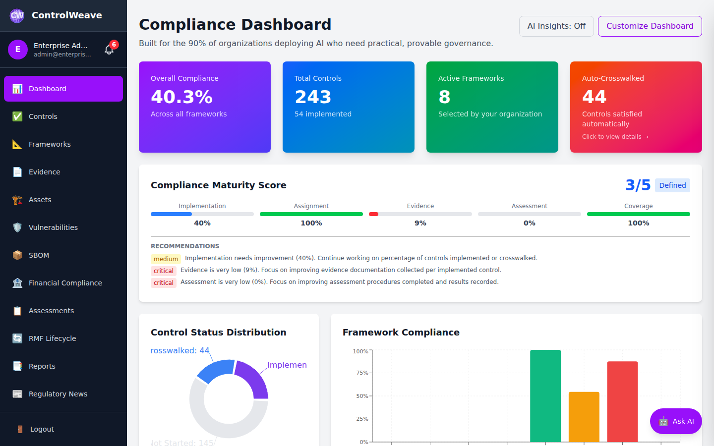
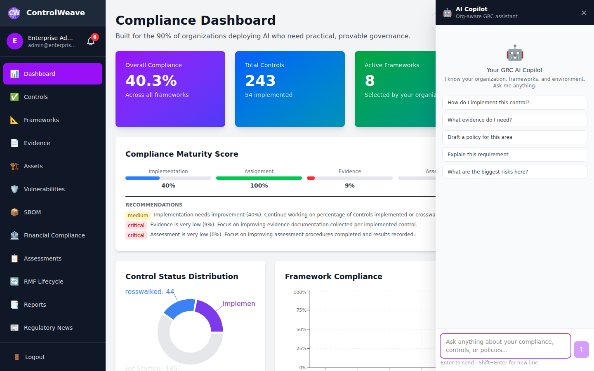

# 🤖 AI Copilot User Guide

Master ControlWeave's AI Copilot - your intelligent GRC assistant available 24/7.

## What is the AI Copilot?

The AI Copilot is an intelligent assistant that understands your organization's compliance posture and helps you with GRC tasks through natural language conversation.

**Key Features:**
- 🧠 **Org-Aware**: Knows your frameworks, controls, evidence, and compliance status
- 📍 **Page-Aware**: Understands the context of where you are in the app
- 💬 **Conversational**: Ask questions in plain English
- 📚 **Persistent**: Chat history saved across sessions
- ⚡ **Quick Actions**: One-click prompts for common tasks

---

## Accessing the AI Copilot

### Global Access (All Pages)

**Purple Button** (bottom-right corner):
1. Click the purple **"Ask AI"** button
2. Copilot panel slides in from the right
3. Start typing your question
4. Hit Enter or click Send


*Figure 1: AI Copilot button - Always accessible from any page*


*Figure 2: AI Copilot panel - Chat with your GRC assistant*

**Keyboard Shortcut**:
- Press `Ctrl + K` (Windows/Linux)
- Press `Cmd + K` (Mac)

### Embedded AI Panels

Some pages have embedded AI analysis that auto-triggers:
- **Dashboard**: AI insights panel
- **Assessments**: Assessment guidance
- **Vulnerabilities**: Remediation suggestions

---

## Prerequisites

### 1. Configure LLM Provider

Before using AI Copilot, you need to configure an LLM provider:

1. Go to **Settings** → **LLM Configuration**
2. Choose a provider (see options below)
3. Enter API key
4. Test connection
5. Save

**Available Providers:**

| Provider | Cost | Speed | Best For |
|----------|------|-------|----------|
| **Google Gemini** | FREE tier! | Fast | Getting started, quick queries |
| **Groq** | FREE tier! | Very Fast | High throughput, rapid responses |
| **Ollama** | FREE (self-host) | Medium | Privacy, offline use |
| **Anthropic Claude** | Paid | Medium | Deep analysis, policy generation |
| **OpenAI GPT-4** | Paid | Fast | Versatile, comprehensive answers |
| **xAI Grok** | Paid | Fast | Fast, capable responses |

> **💡 Recommendation**: Start with Google Gemini or Groq free tier

### 2. Understand Tier Limits

**AI Request Limits per Month:**
- Community: 10 requests/month
- Pro: Unlimited
- Enterprise: Unlimited
- Gov Cloud: Unlimited

**What Counts as a Request:**
- Each message you send to Copilot
- Each AI analysis you run (Gap Analysis, etc.)
- Embedded AI panel generations

**What Doesn't Count:**
- Viewing past conversations
- Opening the Copilot panel
- Reading AI-generated results

---

## How to Use the AI Copilot

### Basic Usage

**1. Ask a Question**
```
Example: "What are my top 5 compliance gaps?"
```

**2. Wait for Response**
- AI analyzes your organization data
- Generates contextualized answer
- Response appears in chat

**3. Follow Up**
```
Example: "How do I fix the AC-2 gap?"
```

**4. Get Detailed Guidance**
- AI provides step-by-step instructions
- Specific to your organization
- Includes relevant context

### Org-Aware Context

The Copilot automatically knows:
- ✅ Your activated frameworks
- ✅ Your implemented controls
- ✅ Your assessment history
- ✅ Your evidence library
- ✅ Your POA&M items
- ✅ Your asset inventory (if CMDB enabled)
- ✅ Your vulnerability status
- ✅ Your organization tier

**Example:**
```
You: "How many controls do I have left to implement?"

AI: "You have 42 controls remaining across your 3 active 
frameworks (NIST 800-53, SOC 2, ISO 27001). 
Of these, 15 are high-priority and 8 are due within 30 days."
```

### Page-Aware Prompts

When you open Copilot from different pages, it adjusts its context:

**From Controls Page:**
- Knows which controls you're viewing
- Can discuss specific control details
- Provides implementation guidance

**From Assessments Page:**
- Knows which assessments you're viewing
- Can explain assessment procedures
- Suggests assessment strategies

**From Dashboard:**
- Provides overall compliance status
- Identifies priority actions
- Offers strategic guidance

---

## Common Use Cases

### 1. Understanding Controls

**Ask:**
- "Explain NIST 800-53 AC-2 in simple terms"
- "What's the difference between AC-2 and AC-3?"
- "How do I implement IA-5(1)?"

**Get:**
- Plain English explanations
- Implementation examples
- Best practices

### 2. Gap Analysis

**Ask:**
- "What are my compliance gaps?"
- "Which controls should I prioritize?"
- "What's missing for SOC 2 readiness?"

**Get:**
- List of incomplete controls
- Priority rankings
- Remediation timelines

### 3. Policy Generation

**Ask:**
- "Generate an access control policy"
- "Draft an incident response procedure"
- "Create a data classification policy"

**Get:**
- Complete policy documents
- Tailored to your organization
- Ready to customize

### 4. Assessment Help

**Ask:**
- "How do I assess AC-1?"
- "What evidence do I need for this control?"
- "Explain the assessment procedure"

**Get:**
- Step-by-step assessment guide
- Evidence examples
- Common pitfalls to avoid

### 5. Compliance Questions

**Ask:**
- "Do I need HIPAA if I don't store PHI?"
- "What's the difference between SOC 2 Type I and Type II?"
- "How often should I assess controls?"

**Get:**
- Clear answers
- Regulatory context
- Best practice recommendations

### 6. Remediation Planning

**Ask:**
- "How do I fix this vulnerability?"
- "What's the fastest way to close this gap?"
- "Create a remediation plan for AC-2"

**Get:**
- Step-by-step remediation plan
- Resource requirements
- Timeline estimates

### 7. Framework Selection

**Ask:**
- "What frameworks do I need for healthcare SaaS?"
- "Should I get ISO 27001 or SOC 2 first?"
- "What frameworks do my customers expect?"

**Get:**
- Framework recommendations
- Industry context
- Implementation guidance

---

## Quick Action Buttons

The Copilot provides one-click prompts for common tasks:

**Quick Actions:**
- 🔍 "Analyze my compliance gaps"
- 📋 "List my overdue assessments"
- 🎯 "What should I prioritize today?"
- 📊 "Show my compliance status"
- 💡 "Suggest quick wins"
- 📝 "Help me with this control" (on control pages)

Click any button to instantly run that prompt.

---

## Advanced Features

### Multi-Turn Conversations

The Copilot maintains conversation context:

```
You: "Explain AC-2"
AI: [Explains access control management]

You: "How do I implement it?"
AI: [Provides implementation steps]

You: "What evidence do I need?"
AI: [Lists evidence requirements]

You: "Generate a policy for this"
AI: [Creates policy document]
```

### Reference Specific Items

You can reference controls, assessments, etc. by ID:

```
"Explain control AC-2"
"Show assessment results for SOC2-CC6.1"
"What's the status of POA&M item 15?"
"Summarize evidence for IA-5"
```

### Ask for Comparisons

```
"Compare NIST 800-53 vs ISO 27001"
"What's the difference between Pro and Enterprise tier?"
"Compare Claude vs GPT-4 for compliance work"
```

### Request Formats

Specify output format:

```
"List my gaps as a bullet list"
"Create a table of my framework coverage"
"Generate a JSON export of my controls"
"Format this as a checklist"
```

---

## Best Practices

### DO:
✅ Be specific in your questions
✅ Provide context when needed
✅ Follow up for clarification
✅ Use quick action buttons
✅ Reference specific controls/items by ID
✅ Ask for examples and explanations
✅ Request step-by-step guidance

### DON'T:
❌ Ask vague questions like "Help me"
❌ Expect AI to take actions (it only advises)
❌ Trust AI blindly - verify important information
❌ Use AI for final audit decisions
❌ Share sensitive data in prompts (stay general)
❌ Rely on AI for legal advice

---

## Chat History

### Viewing Past Conversations

1. Open AI Copilot
2. Scroll up to see past messages
3. Last 20 messages saved per organization
4. History persists across sessions

### Starting Fresh

To clear context and start new topic:
1. Type "/clear" or "/reset"
2. Or close and reopen Copilot panel
3. Or click "New Conversation" button

---

## Troubleshooting

### "API Key Not Configured"

**Problem**: No LLM provider set up

**Solution**:
1. Go to Settings → LLM Configuration
2. Add API key for at least one provider
3. Test connection
4. Return to Copilot

### "Usage Limit Reached"

**Problem**: Exceeded monthly AI request limit

**Options**:
1. Wait until next month (limit resets)
2. Upgrade tier (Pro = Unlimited)
3. Use Ollama (no request limits, but requires setup)

### Slow Responses

**Problem**: AI taking long to respond

**Solutions**:
- Switch to faster provider (Groq is fastest)
- Ask simpler questions
- Break complex requests into smaller questions
- Check internet connection

### Generic Answers

**Problem**: AI not providing org-specific answers

**Possible Causes**:
- Little data in system yet (need more controls/evidence)
- Question too general
- Need to provide more context

**Solutions**:
- Be more specific: "What are MY gaps?" vs "What are gaps?"
- Reference specific frameworks/controls
- Add more data to system first

### Wrong Information

**Problem**: AI provides incorrect information

**What to Do**:
- ❌ Don't rely solely on AI for critical decisions
- ✅ Verify important information in official sources
- ✅ Use AI as a starting point, not final answer
- ✅ Report issues to support

---

## Privacy & Security

### Data Privacy

**What AI Can See:**
- Your organization's controls, frameworks, evidence metadata
- Assessment results and status
- Control implementation notes
- Asset inventory (if CMDB enabled)

**What AI Cannot See:**
- Other organizations' data
- Actual file contents (only metadata)
- Personal user information
- Credentials or API keys

### BYOK (Bring Your Own Key)

When you use your own API key:
- ✅ You control the AI provider relationship
- ✅ Your data goes directly to provider (not stored by ControlWeave)
- ✅ Subject to provider's privacy policy
- ✅ You manage costs

**Recommendation**: Review your LLM provider's privacy policy

### Ollama (On-Premise)

For maximum privacy:
- Install Ollama locally
- Models run on your own hardware
- No data leaves your network
- No API costs
- Full control

**Setup**: [Ollama Integration Guide](../integrations/OLLAMA.md)

---

## Tips for Getting Better Answers

### 1. Be Specific

❌ Bad: "Help with controls"
✅ Good: "How do I implement AC-2 for a small company?"

### 2. Provide Context

❌ Bad: "What frameworks?"
✅ Good: "What frameworks should a healthcare SaaS with 50 employees adopt?"

### 3. Ask Follow-Up Questions

```
Initial: "Explain AC-2"
Follow-up: "How does this apply to cloud environments?"
Follow-up: "What evidence do I need?"
Follow-up: "Generate a policy template"
```

### 4. Request Examples

```
"Show me an example of an access control policy"
"Give me sample evidence for IA-5"
"What does a satisfied AC-2 assessment look like?"
```

### 5. Break Down Complex Questions

❌ Bad: "Tell me everything about SOC 2 compliance, how to implement it, what evidence I need, and create a project plan"

✅ Good sequence:
1. "What is SOC 2?"
2. "What controls do I need for SOC 2?"
3. "Create an implementation plan for SOC 2"
4. "What evidence is needed for SOC 2 controls?"

---

## AI Analysis vs AI Copilot

### AI Copilot
- Conversational interface
- Quick questions and answers
- General guidance
- Always available
- Good for learning and clarification

### AI Analysis Features
- Structured analysis (Gap Analysis, etc.)
- Formal reports
- Detailed recommendations
- Scheduled tasks
- Good for formal deliverables

**When to Use Which:**
- Quick question → Use Copilot
- Need formal report → Use AI Analysis
- Learning about control → Use Copilot
- Audit readiness scoring → Use AI Analysis
- Brainstorming → Use Copilot
- Executive summary → Use AI Analysis

---

## Example Conversations

### Example 1: New User

```
User: "I'm new to GRC. Where do I start?"

AI: "Welcome! Here's a great starting path for you:

1. First, select 1-2 frameworks relevant to your industry
   - Healthcare → Start with HIPAA
   - Tech/SaaS → Start with SOC 2
   - Government → Start with NIST 800-171

2. Implement a few 'quick win' controls:
   - AC-1 (Access Control Policy)
   - AT-1 (Security Awareness Training)
   - IR-1 (Incident Response Policy)

3. Upload evidence for existing policies

4. Run your first assessments

Would you like me to help you choose frameworks based on your industry?"

User: "Yes, I'm in healthcare SaaS"

AI: "Perfect! For healthcare SaaS, I recommend:

1. HIPAA (required for PHI)
2. SOC 2 (customers will require this)
3. NIST CSF 2.0 (risk management framework)

Start by activating HIPAA and SOC 2. Many controls overlap, so implementing one often satisfies both. Would you like me to identify the highest-value overlapping controls?"
```

### Example 2: Preparing for Audit

```
User: "I have a SOC 2 audit in 3 months. Am I ready?"

AI: "Let me check your SOC 2 readiness...

Current Status:
- 42 of 67 SOC 2 controls implemented (63%)
- 8 controls in progress
- 17 controls not started
- 23 assessments completed
- 15 assessments overdue

Critical Gaps:
1. CC6.2 (Logical Access) - Not started
2. CC7.1 (System Operations) - Partial implementation
3. CC8.1 (Change Management) - Missing evidence

Timeline Assessment:
⚠️ You're not quite ready yet. With 17 controls not started and 8 in progress, you need to accelerate.

Recommended Action Plan:
1. This Week: Start all 17 remaining controls
2. Weeks 2-6: Implement critical controls (CC6.x, CC7.x)
3. Weeks 7-10: Complete all assessments
4. Weeks 11-12: Evidence collection and review

Would you like me to generate a detailed project plan?"
```

---

## Quick Reference Card

### Common Prompts

**Status Checks:**
- "What's my overall compliance percentage?"
- "Show my framework coverage"
- "List overdue items"

**Learning:**
- "Explain [control ID]"
- "What is [framework]?"
- "How do I implement [control]?"

**Planning:**
- "What should I work on today?"
- "Prioritize my gaps"
- "Create an implementation plan"

**Generation:**
- "Draft a policy for [control]"
- "Generate assessment procedures"
- "Create evidence checklist"

---

**Next Steps:**
- [AI Analysis Features](AI_ANALYSIS.md)
- [LLM Configuration](SETTINGS.md#llm-configuration)
- [Quick Wins Guide](QUICK_WINS.md)
