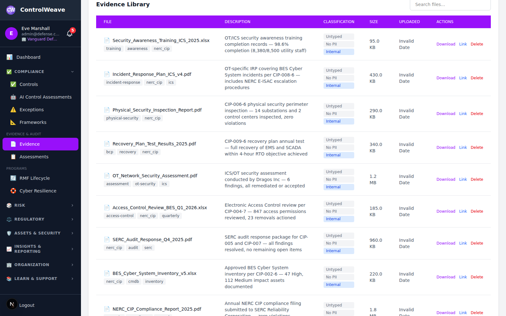
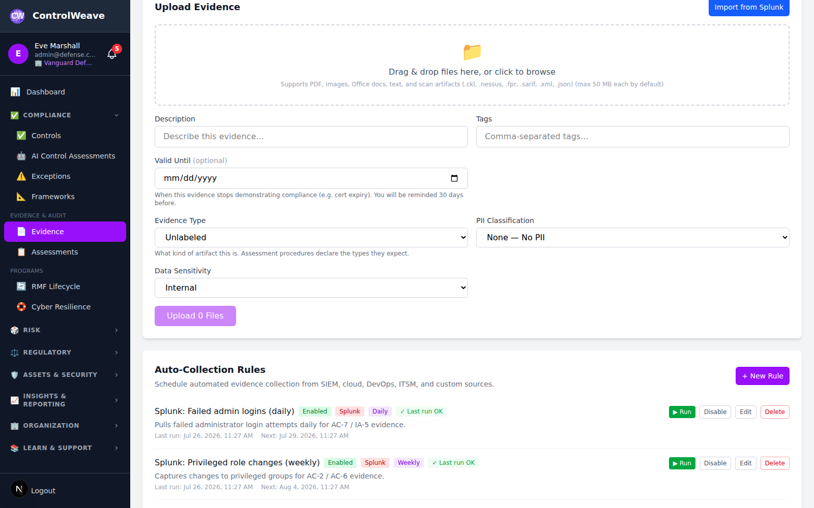
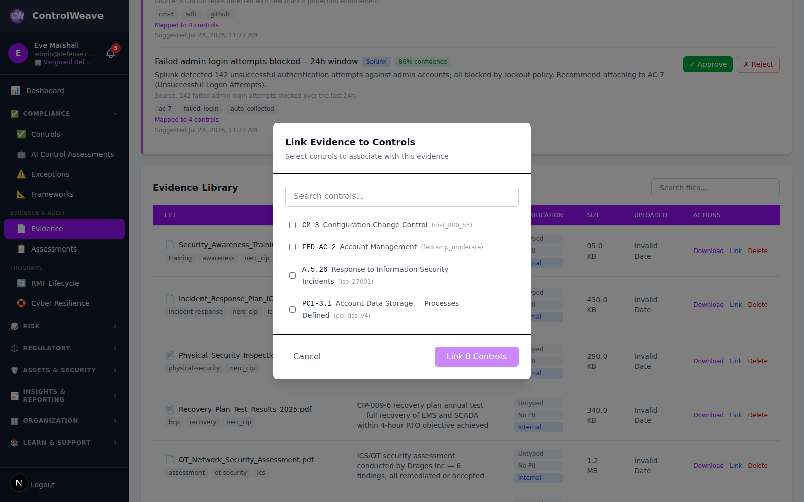
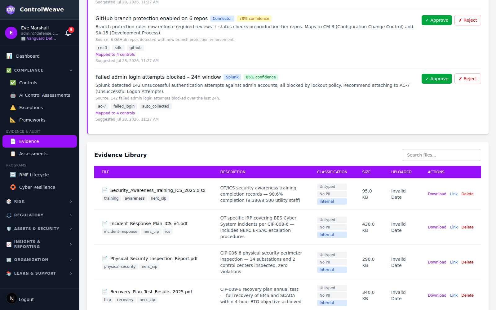

# 📁 Evidence Management Guide

This guide covers how to upload, organize, and manage compliance evidence in ControlWeave to support control assessments and audit readiness.

## ⏱️ Time Commitment
- **Quick Setup**: 5 minutes
- **Full Configuration**: 20-30 minutes

## 📋 Prerequisites
- ControlWeave account (any tier)
- Compliance controls activated via Frameworks
- Evidence files prepared (policies, procedures, screenshots, etc.)

---

## Overview

ControlWeave's Evidence Management module helps you:
- 📤 Upload and store compliance evidence securely
- 🔗 Link evidence to one or more security controls
- 🔒 Verify file integrity with SHA256 checksums
- 🏷️ Tag and classify evidence by sensitivity and data type
- 📅 Manage retention schedules and legal holds
- 📦 Version evidence to track document history
- 📥 Import evidence from Splunk and other integrations

ControlWeaver has no tier gating — evidence uploads, control linking, integrity verification, PII classification, and retention management are all available to every authenticated user.
| **Auto-Evidence Collection** | ❌ | ✅ | ✅ | ✅ |
| **AI Evidence Suggestions** | ❌ | ✅ | ✅ | ✅ |
| **Splunk Connector** | ❌ | ✅ | ✅ | ✅ |
| **SIEM Integration** | ❌ | ❌ | ✅ | ✅ |

---

## Step 1: Navigate to Evidence

### 1.1 Open the Evidence Module

1. Click **Evidence** in the left sidebar, or
2. Navigate via **Controls** → open any control → **Add Evidence**


*Figure 1.1: Evidence Management page*

### 1.2 Evidence List Overview

The Evidence page shows:
- **File Name**: Original filename of the uploaded document
- **Description**: Brief note about the evidence
- **Tags**: Categorization labels
- **Linked Controls**: Number of controls this evidence supports
- **Uploaded By / Date**: Audit trail of who added the file
- **Data Sensitivity**: Classification level of the evidence
- **Integrity Status**: Whether the file hash has been verified

---

## Step 2: Upload Evidence

### 2.1 Start an Upload

1. Click **Upload Evidence** (top-right of the Evidence page)
2. The upload modal opens


*Figure 2.1: Evidence upload form*

### 2.2 Select File

- **Drag and drop** a file onto the upload area, or
- Click **Browse Files** to open the file picker

**Supported File Types**:

| Category | Formats |
|----------|---------|
| Documents | PDF, DOCX, DOC, XLSX, XLS |
| Images | JPG, JPEG, PNG, GIF |
| Security Scan Results | SARIF, NESSUS, CKL, FPR |
| Structured Data | XML, JSON |
| Text | TXT, CSV |
| Archives | ZIP |

> **⚠️ File Size Limit**: Maximum 50 MB per file.

### 2.3 Add Metadata

Fill in the evidence details:

**Required**:
- **Description**: What this evidence proves (e.g., "Information Security Policy v2.1 – approved by CISO")

**Optional but Recommended**:
- **Tags**: Comma-separated keywords for easy search (e.g., `policy, access-control, approved-2025`)
- **PII Classification**: Sensitivity of the data in the file
  - `None` – No personally identifiable information
  - `Low` – General PII (names, email addresses)
  - `Moderate` – Sensitive PII (phone, address)
  - `High` – Special category PII (health, financial)
  - `Critical` – Regulated data requiring strict handling
- **Data Sensitivity**: Overall classification of the file
  - `Public`, `Internal`, `Confidential`, `Restricted`
- **Retention Until**: Date after which the evidence may be archived or deleted


*Figure 2.2: Evidence metadata fields*

### 2.4 Complete the Upload

1. Review the details
2. Click **Upload Evidence**


*Figure 2.3: Upload success confirmation*

A SHA256 integrity hash is computed automatically on upload to support later verification.

---

## Evidence Types

Every uploaded artifact can carry an **evidence type** — what kind of thing it
is, chosen from a shared vocabulary:

| Code | Label | Use for |
|---|---|---|
| `policy` | Policy or Standard | Approved policy, standard, or written procedure |
| `configuration` | Configuration Export | System or tool configuration showing how a control is set |
| `log` | Log or Audit Trail | System, application, or audit log export covering a period |
| `ticket` | Ticket or Change Record | Change, incident, or service ticket showing a process ran |
| `report` | Assessment or Scan Report | Vulnerability scan, penetration test, or audit report |
| `attestation` | Attestation or Certificate | Signed attestation, management assertion, certificate |
| `training_record` | Training Record | Awareness or role-specific training completions |
| `contract` | Contract or Agreement | Vendor agreement, DPA, BAA, or other commitment |
| `diagram` | Diagram | Architecture, network, or data-flow diagram |
| `inventory` | Inventory or Register | Asset, data, system, vendor, or processing-activity inventory |
| `approval` | Approval or Sign-off | Documented approval, authorization, or review sign-off |
| `screenshot` | Screenshot | Captured UI state — weaker than a system-generated export |
| `interview_notes` | Interview or Walkthrough Notes | Record of a walkthrough with control owners |
| `other` | Other | Anything the vocabulary does not describe |

The vocabulary is **framework-neutral by design**. These are artifact shapes,
not SOC 2 or HIPAA or PCI concepts, so one artifact can satisfy procedures
across several frameworks at once — which is what makes it work alongside
crosswalks.

Assessment procedures declare the types they expect (`expected_evidence_types`),
so you can see what a procedure is asking for before you go looking for it.
Every assessment procedure in the catalog carries these, across all frameworks.

Evidence uploaded before this feature shipped is shown as **Untyped** — the
type was not guessed retroactively, because a wrong label is worse than an
absent one. Set it when you next edit the item.

The type list is served from the API (`GET /evidence/types`), so a new type
becomes available in the picker without a frontend release.

Filter the evidence list by type with `?evidence_type=log` (comma-separate for
several).

## Step 3: View Evidence Details

### 3.1 Fetch an Evidence Record

The Evidence Library table shows the file name, type, size and upload date, and
each row offers **Download** and **Link to Controls**. The full record — including
everything below — is served by the API; there is no evidence detail page in the
dashboard yet:

```
GET /api/v1/evidence/:id
```

**Details Returned**:
- Full file metadata (name, size, MIME type, upload date, uploader)
- SHA256 hash and last integrity verification timestamp
- PII classification and data sensitivity level
- Retention date
- Version number
- List of linked controls

### 3.2 Download Evidence

1. Click **Download** on the evidence detail page or in the list actions
2. File is downloaded to your browser's default downloads folder

---

## Step 4: Link Evidence to Controls

Linking evidence to controls is essential for audit readiness — it shows auditors exactly which documents satisfy each control requirement.

### 4.1 Link from Evidence Detail

1. Open the evidence record
2. Click **Link to Control**
3. Search for the control by ID or title (e.g., "AC-2" or "Access Management")


*Figure 4.1: Link evidence to a control*

4. Select the control(s) to link
5. Optionally add a **Note** explaining how this evidence satisfies the control
6. Click **Link**

### 4.2 Link from a Control

1. Navigate to **Controls**
2. Open the control you want to support
3. Click **Add Evidence**
4. Choose **Upload New** or **Select Existing**
5. If selecting existing, search your evidence library and click **Link**

### 4.3 Unlink Evidence

1. Open the evidence record
2. In the **Linked Controls** section, click **Unlink** next to the control you want to remove
3. Confirm the action

> **💡 Tip**: One piece of evidence can be linked to multiple controls, which is useful when a single policy document satisfies requirements across different frameworks.

---

## Step 5: Edit Evidence Metadata

To update the description, tags, classification, or retention date of existing evidence:

```
PUT /api/v1/evidence/:id
```

Editing metadata is not yet exposed in the dashboard — send the changed fields to
the endpoint above.

> **Note**: The original file cannot be replaced. To update the file, upload a new version (see Step 6).

---

## Step 6: Evidence Versioning

ControlWeave tracks evidence versions to maintain an audit trail when documents are updated.

### 6.1 Upload a New Version

1. Open the existing evidence record
2. Click **Upload New Version**
3. Select the updated file
4. Add a description noting what changed (e.g., "Updated to reflect 2025 access control policy revision")
5. Click **Upload**

The version counter increments automatically (v1 → v2 → v3...).

### 6.2 View Version History

```
GET  /api/v1/evidence/:id/versions
POST /api/v1/evidence/:id/versions
GET  /api/v1/evidence/:id/versions/:versionNumber/download
```

Lists every prior version with its upload date and uploader, and lets you add a
new version or download an old one. Versioning has no UI yet.

---

## Version History

Every change to an evidence record archives the previous version rather than overwriting it. The evidence record itself is always the current version; superseded versions are kept with their own file, hash, and metadata.

### What a version preserves

Each archived version keeps the file name, stored file, size, MIME type, and SHA256 hash **as they were**, plus the description, tags, evidence type, PII classification, PII types, and data sensitivity that applied at the time — along with who superseded it and an optional change note.

That last part matters more than it sounds. If evidence is reclassified from PII "low" to "high", the record of what it was classified as *while it was being relied on* is preserved. Without that, a reclassification silently rewrites history.

### Replacing a file

Use **Upload new version** on the evidence record to replace the file. The superseded file stays on disk and its hash stays in the version history, so "this evidence has not been altered" remains demonstrable across a replacement rather than covering only whatever is current.

Add a change note explaining why — "signed copy received from auditor", "redacted customer names" — since that note is what a reviewer reads first.

### Reviewing prior versions

The version history lists superseded versions newest first. Each can be downloaded individually, so an auditor examining a control at a point in time can retrieve the evidence as it stood then.

> **📋 Audit note**: File replacement is recorded in the audit log as `evidence_version_created` with the archived and new version numbers. Version records are immutable — nothing in the application updates or deletes them, so history cannot be edited after the fact.

Deleting an evidence record deletes its version history with it.

---

## Step 7: Integrity Verification

ControlWeave uses SHA256 hashing to verify that evidence files have not been altered since upload.

### 7.1 Run an Integrity Check

```
GET /api/v1/evidence/:id/integrity-check
```

ControlWeave recomputes the file hash and compares it to the stored value. There
is no **Verify Integrity** button in the dashboard yet.

**Result States**:
- ✅ **Verified** – File matches the original hash
- ❌ **Modified** – File hash does not match; investigate immediately

> **⚠️ Important**: A "Modified" result may indicate tampering or data corruption. Preserve the record and investigate before relying on the evidence in an audit.

---

## Rate Limits on Evidence Operations

Evidence files may contain PII, so the routes that read or destroy them are rate limited per user. You will not notice these during normal work — they exist so a compromised account cannot drain an organization's evidence library, and so nobody can hammer the hashing endpoint.

| Operation | Limit |
|---|---|
| Download a file (current or a prior version) | 30 / minute each |
| Upload a new version of a file | 20 / minute |
| List version history | 120 / minute |
| Verify integrity (re-hashes the stored file) | 30 / minute |
| Delete evidence | 30 / minute |
| Edit metadata, link to a control, unlink | 60 / minute each |
| View an evidence record | 120 / minute |
| Browse the evidence list | 120 / minute |
| Upload (single) | 20 / minute |
| Upload (bulk) | 5 / minute |

Exceeding a limit returns **429 Too Many Requests**; wait for the window to roll over and retry. If you are pulling a large evidence set for an auditor, expect to pace downloads rather than scripting them in a tight loop.

---

## Step 8: Delete Evidence

### 8.1 Standard Delete

1. Open the evidence record
2. Click **Delete**
3. Confirm the deletion

> **⚠️ Warning**: Deletion is permanent. Any control links are also removed.

### 8.2 Legal Hold

Evidence under a **legal hold** cannot be deleted. To remove a legal hold:
- Contact your organization administrator
- The hold must be lifted before deletion is permitted

---

## Step 9: Search and Filter Evidence

### 9.1 Search

Use the search bar at the top of the Evidence page to find files by:
- File name
- Description text
- Tags

> **💡 Improved in v2.3.0**: Evidence search now delivers faster, more accurate results and correctly handles large evidence libraries. Real-time filtering starts as soon as you type.

### 9.2 Filter

Use the filter panel to narrow results by:
- **Data Sensitivity** (Public, Internal, Confidential, Restricted)
- **PII Classification**
- **Linked Control**
- **Uploaded By**
- **Date Range**


*Figure 9.1: Evidence search and filter options*

> **💡 Pagination fix (v2.3.0)**: Organizations with more than 1,000 evidence items previously experienced display issues with paginated results. This has been resolved — all pages now load correctly regardless of evidence library size.

---

## Step 10: Auto-Evidence Collection

ControlWeave supports automated evidence collection through configurable **Collection Rules**. Rules run on a schedule and automatically import evidence from connected sources, linking it to the controls you specify.

### 10.1 Supported Source Types

Auto-Evidence Collection supports eight source types organized into categories. **Splunk and GitHub perform full live data retrieval** — querying the external system and importing real event data into ControlWeave. All other sources create evidence records that document the configuration and connectivity of your integration (useful for demonstrating that security tools are connected and in use), but do not pull live log data.

| Category | Source Type | Description |
|----------|-------------|-------------|
| **SIEM** | **Splunk** | Query Splunk Enterprise or Cloud via SPL. Performs live data retrieval — imports real event data from your Splunk indexes. Requires Splunk configured in **Settings → Integrations → Splunk**. |
| **SIEM** | **Microsoft Sentinel** | Creates an evidence record documenting your Azure Sentinel workspace connection and query configuration. |
| **SIEM** | **CrowdStrike Falcon** | Creates an evidence record documenting your CrowdStrike Falcon integration configuration (filters, time range, etc.). |
| **Cloud** | **AWS CloudTrail** | Creates an evidence record documenting your AWS CloudTrail integration configuration (region, event filters, etc.). |
| **DevOps** | **Jira** | Creates an evidence record documenting your Jira integration configuration (JQL query, project key, etc.). |
| **DevOps** | **GitHub** | Performs live data retrieval — imports real code scanning alerts, Dependabot alerts, org audit log events, or pull requests from a repository (or org, for audit log). Requires a GitHub token configured in **Settings → Integrations → GitHub**. |
| **ITSM** | **ServiceNow (ITSM)** <!-- ip-hygiene:ignore --> | Creates an evidence record documenting your ITSM platform integration configuration (table, query filter, etc.). |
| **Custom** | **Connector** | Creates an evidence record documenting your custom connector configuration (endpoint URL, payload format, etc.). |

> **💡 Tip**: Use Splunk or GitHub for live log and event data collection. Use the other source types to create configuration evidence records that demonstrate your security and DevOps tools are integrated and actively used in your compliance program.

### 10.2 Create a Collection Rule

1. Go to the **Evidence** page and scroll to the **Auto-Collection Rules** section
2. Click **New Rule**
3. Fill in the rule details:
   - **Name**: Descriptive label for the rule (e.g., "Daily Auth Logs")
   - **Source**: Select from the available source types (see 10.1 above)
   - **Schedule**: `Manual only`, `Daily`, `Weekly`, or `Monthly`
   - **Tags**: Labels applied automatically to collected evidence
   - **Controls**: Link collected evidence to one or more controls

4. For **Splunk** rules, configure the query:
   - **Search Query**: SPL expression (e.g., `index=main sourcetype=auth`)
   - **Earliest Time**: Start of the time range (e.g., `-24h@h`)
   - **Latest Time**: End of the time range (e.g., `now`)
   - **Max Events**: Maximum number of log events to import per run

   For **GitHub** rules, configure:
   - **Repository**: `owner/repo` (or an org login, when **Event Type** is Audit Log)
   - **Event Type**: Code Scanning Alerts, Dependabot Alerts, Audit Log, or Pull Requests
   - **Time Range**: Relative window (e.g., `-7d`)
   - **Max Results**: Maximum number of results to import per run

5. Click **Save Rule**

### 10.3 Run a Rule Manually

1. Scroll to the **Auto-Collection Rules** section on the Evidence page
2. Find the rule you want to run
3. Click **▶ Run**
4. Collected evidence appears in the Evidence list and is linked to the specified controls

### 10.4 One-Time Splunk Import

For an ad-hoc Splunk import without creating a rule:

1. Go to the **Evidence** page and click **Import from Splunk** in the Upload Evidence panel
2. Enter your search query, time range, and title
3. Click **Import**

Imported logs are stored as evidence records and can be linked to controls like any other file.

> **💡 Note**: GitHub does not yet have an equivalent one-time import button on the Evidence page — use an **Auto-Evidence Collection Rule** (10.2) with a `Manual only` schedule and **Run** it on demand (10.3) to get the same ad-hoc behavior.

---

## Step 11: AI-Powered Evidence Suggestions

ControlWeave's AI can automatically scan your connected integrations, analyze incoming data against your selected compliance frameworks, and **suggest evidence items** mapped to the correct controls. Suggested evidence goes to a staging area — nothing is added to your official evidence library until you approve it.

### 11.1 How It Works

```
Connected Integrations → AI Scan → Pending Evidence (staging)
                                        │
                              User reviews each suggestion
                                  ├── ✓ Approve → Official Evidence Library + control links
                                  └── ✗ Reject  → Dismissed (audit-logged)
```

1. **Scan**: Click **🔍 Scan Integrations** in the **AI Evidence Suggestions** section on the Evidence page. The AI:
   - Detects which integrations are connected (e.g., Splunk)
   - Queries recent audit logs, auth events, and any enabled collection rules
   - Analyzes the data against your org's active frameworks
   - Maps each data set to the most relevant framework controls
   - Creates pending evidence items with a confidence score

2. **Review**: Each suggestion shows:
   - **AI-generated title and description** explaining what the evidence is and why it matters
   - **Confidence score** (0–100%) indicating how certain the AI is
   - **Mapped controls** the AI identified
   - **Source tags** for categorization

3. **Approve or Reject**:
   - **✓ Approve** — promotes the item to the official evidence library, writes the payload to disk, and links it to the suggested controls
   - **✗ Reject** — marks it as rejected (not deleted, so you can review past decisions)

### 11.2 Trigger an AI Scan

1. Go to the **Evidence** page
2. Scroll to the **AI Evidence Suggestions** section (purple left-border card)
3. Click **🔍 Scan Integrations**
4. Wait for the AI to finish (this may take a minute depending on data volume)
5. Review each pending suggestion that appears

### 11.3 Approve Pending Evidence

1. In the **AI Evidence Suggestions** section, review a suggestion's title, description, confidence, and mapped controls
2. Click **✓ Approve** to add it to your official evidence library
3. The evidence is automatically linked to the AI-suggested controls
4. The item moves from "pending" to "approved" status

### 11.4 Reject a Suggestion

1. Click **✗ Reject** on any suggestion you don't want
2. The item is marked as rejected with an audit trail
3. Rejected items are not deleted and can be reviewed later

### 11.5 API Endpoints

| Method | Endpoint | Description |
|--------|----------|-------------|
| `POST` | `/api/v1/pending-evidence/scan` | Trigger AI scan of connected integrations |
| `GET` | `/api/v1/pending-evidence?status=pending` | List pending suggestions |
| `GET` | `/api/v1/pending-evidence/stats` | Get counts by status (pending/approved/rejected) |
| `POST` | `/api/v1/pending-evidence/:id/approve` | Approve and promote to official evidence |
| `POST` | `/api/v1/pending-evidence/:id/reject` | Reject a suggestion |

---

## 🎯 Evidence Collection Workflow

**When implementing a control**:
1. Identify what documentation proves the control is in place
2. Upload the relevant file(s)
3. Add descriptive metadata and tags
4. Classify the sensitivity level
5. Link to the control(s) the evidence satisfies
6. Set a retention date if applicable

**Common Evidence Types by Control Category**:

| Control Category | Evidence Examples |
|-----------------|------------------|
| Access Control | User access lists, provisioning procedures, screenshots |
| Audit & Accountability | Log retention policies, SIEM screenshots |
| Configuration Management | Baseline configs, change management tickets |
| Incident Response | IR procedures, after-action reports |
| Risk Assessment | Risk register, vulnerability scan reports |
| Security Training | Training completion records, attendance logs |

---

## ✅ Evidence Management Checklist

**Setup**:
- [ ] Evidence module accessed
- [ ] First evidence file uploaded
- [ ] Evidence linked to at least one control

**Ongoing Operations**:
- [ ] New policies/procedures uploaded within 30 days of approval
- [ ] Evidence descriptions are clear and meaningful
- [ ] Tags applied consistently for searchability
- [ ] Sensitivity levels classified accurately
- [ ] Retention dates set for regulated data

**Auto-Collection**:
- [ ] Supported integration sources configured as applicable in Settings → Integrations
- [ ] Collection rules created for recurring evidence sources
- [ ] Rule schedules reviewed (daily/weekly/monthly as appropriate)

**Audit Readiness**:
- [ ] All implemented controls have at least one linked evidence item
- [ ] Evidence files are current (check dates regularly)
- [ ] Integrity verified for critical evidence
- [ ] Version history maintained for updated documents

---

## 🚀 Next Steps

After building your evidence library:

1. **Conduct Assessments**: [Run control assessments with your evidence](ASSESSMENTS.md)
2. **Track Vulnerabilities**: [Link scan reports as evidence](VULNERABILITIES.md)
3. **AI Gap Analysis**: [Ask AI which controls still need evidence](AI_ANALYSIS.md)
4. **Connect Integrations**: [Set up Splunk for automatic evidence scanning](INTEGRATIONS.md)
5. **API Access**: [Use the Pending Evidence API to automate workflows](../integrations/API_DOCS.md#ai-evidence-suggestions-pending-evidence)

> **💡 Token-Efficient AI**: AI evidence scans use a lightweight prompt profile, sending only the reference modules needed for evidence mapping. Learn about the modular prompt architecture in the [AI Analysis Guide](AI_ANALYSIS.md#token-efficient-ai-architecture).

---

**Need Help?** Use the AI Copilot (purple button) or contact contehconsulting@gmail.com
