# 🚀 Getting Started with ControlWeave

Welcome! This guide will walk you through your first steps with ControlWeave, from account creation to running your first compliance assessment.

## ⏱️ Time Commitment
- **Quick Setup**: 10 minutes
- **Full Onboarding**: 30-45 minutes

## 📋 Prerequisites
- Web browser (Chrome, Firefox, Safari, or Edge recommended)
- Email address for account registration
- (Optional) API keys for AI features

---

## Step 1: Create Your Account

### 1.1 Register
1. Navigate to ControlWeave: `http://yourinstance.com/register`
2. Fill in the registration form:
   - **Email**: Your work email address
   - **Password**: Strong password (min 12 characters)
   - **Full Name**: Your name as it should appear in the system
   - **Organization Name**: Your company or organization name

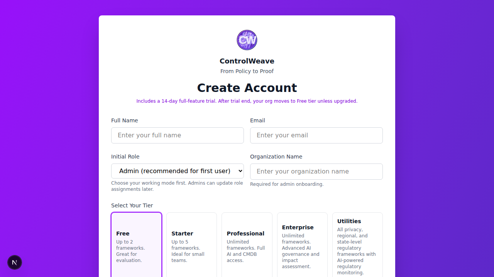
*Figure 1.1: Registration form - Enter your details to create your account*

3. Click **Register**

> **💡 Tip**: Choose your organization name carefully - this will be visible in all reports and assessments.

### 1.2 First Login
1. You'll be automatically logged in after registration
2. You'll land on the Dashboard (mostly empty for now - that's normal!)

*Figure 1.2: Dashboard on first login - Don't worry, it will fill up as you add data*

> **🔐 Login Options**: The login page (`/login`) supports:
> - **Password** (email + password) — available to all users
> - **Two-Factor Authentication (TOTP)** — available to all users; pair with Google Authenticator, Authy, or any TOTP app
> - **Passkey** (biometrics or hardware security key) — available on the Enterprise tier or higher
> - **SSO / Social login** (Google, Microsoft, etc.) — available when configured by your administrator
>
> If you forget your password, click **Forgot password?** on the login page to receive a reset link by email.

> **⏱️ Inactivity Timeout**: By default, ControlWeave automatically signs you out after **30 minutes of inactivity** to keep your account secure. Your deployment administrator may configure a different timeout.

---

## Step 2: Configure Your Organization Profile

### 2.1 Access Settings
1. Click your profile icon (top-right corner)
2. Select **Settings**

*Figure 2.1: Access Settings from your profile menu*

### 2.2 Organization Information
Navigate to **Organization Settings** tab:

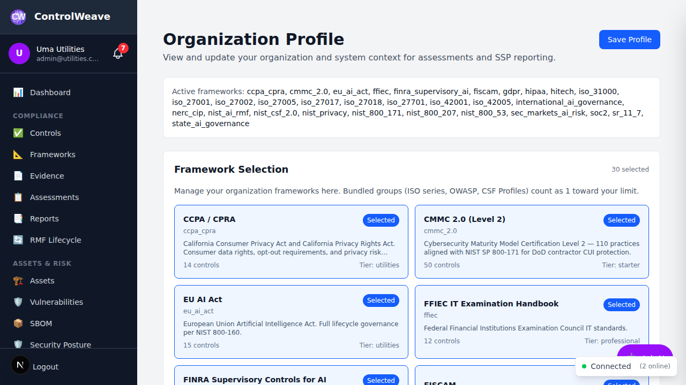
*Figure 2.2: Organization Settings - Configure your organization profile*

**Required Fields**:
- **Organization Name**: Already set during registration
- **Industry**: Select your industry vertical
- **Size**: Number of employees
- **Tier**: Automatically set (Community by default)

**Optional Fields**:
- **Description**: Brief description of your organization
- **Website**: Company website URL
- **Primary Contact**: Main compliance contact

Click **Save Organization Settings**

> **💡 Tip**: To upgrade from the Community tier, go to **Settings** and scroll to **Available Plans**. You can switch between Monthly and Annual billing (annual saves 20%) and upgrade directly from the settings page.

### 2.3 Data Sensitivity Profile
Under **Data Classification**:

1. Select which data types your organization handles:
   - ☐ PII (Personally Identifiable Information)
   - ☐ PHI (Protected Health Information)
   - ☐ PCI (Payment Card Information)
   - ☐ CUI (Controlled Unclassified Information)
   - ☐ FCI (Federal Contract Information)
   - ☐ Export-Controlled Data
   - ☐ Proprietary Business Data

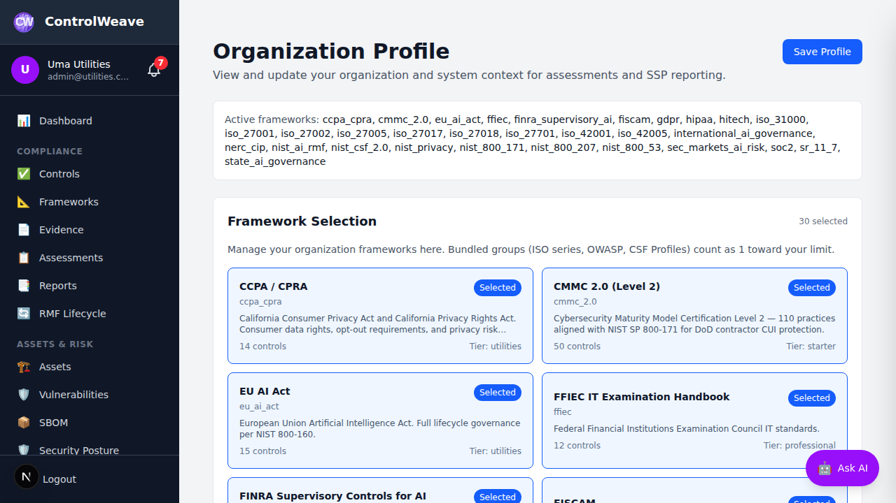
*Figure 2.3: Data Classification - Select the data types your organization handles*

2. This helps ControlWeave suggest relevant frameworks

> **💡 Tip**: Be thorough here - this influences framework recommendations and AI analysis.

---

## Step 3: Select Your Compliance Frameworks

### 3.1 Navigate to Frameworks
1. Click **Frameworks** in the left sidebar
2. You'll see a list of 15+ available frameworks

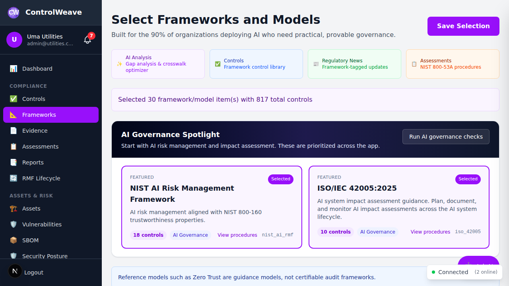
*Figure 3.1: Frameworks page - View all available compliance frameworks*

### 3.2 Choose Relevant Frameworks

**For Different Industries**:

**Healthcare Organizations**:
- ✅ HIPAA (required for healthcare data)
- ✅ NIST 800-53 (comprehensive security controls)
- ✅ SOC 2 (if you're a service provider)

**Financial Services**:
- ✅ SOC 2 (required for service providers)
- ✅ PCI DSS (if handling payment cards)
- ✅ FFIEC (for financial institutions)
- ✅ NIST CSF 2.0 (risk management framework)

**Government Contractors**:
- ✅ NIST 800-171 (required for CUI)
- ✅ NIST 800-53 (comprehensive baseline)
- ✅ FedRAMP (if providing cloud services)

**Technology Companies**:
- ✅ SOC 2 (customer requirement)
- ✅ ISO 27001 (international standard)
- ✅ NIST CSF 2.0 (risk framework)
- ✅ OWASP LLM Top 10 (if using AI)

**AI/ML Companies**:
- ✅ NIST AI RMF (AI risk management)
- ✅ EU AI Act (if serving EU customers)
- ✅ ISO 42001 (AI management system)
- ✅ OWASP Agentic AI Top 10

### 3.3 Activate Frameworks
1. Click **Activate** on each framework you need
2. Framework status changes to "Active"
3. Controls from that framework are now available

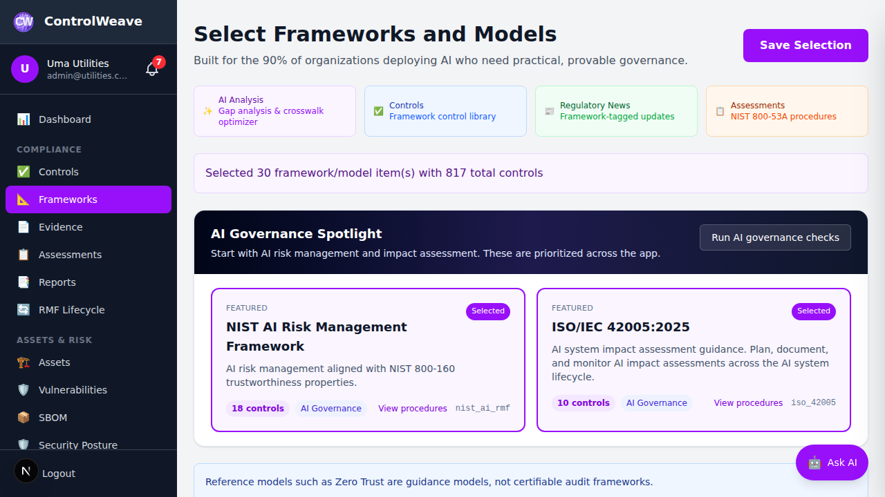
*Figure 3.2: Click Activate to enable a framework*

*Figure 3.3: Active framework with green badge*

> **⚠️ Tier Limits**: 
> - Community: Maximum 2 frameworks
> - Pro: Unlimited  
> - Enterprise: Unlimited

---

## Step 4: Implement Your First Control

Let's implement a simple control to get familiar with the process.

### 4.1 Navigate to Controls
1. Click **Controls** in the left sidebar
2. You'll see all controls from your activated frameworks

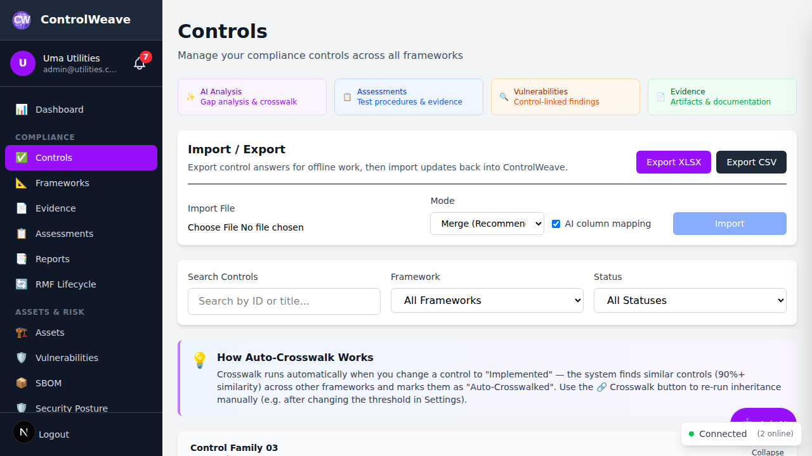
*Figure 4.1: Controls list - All controls from your activated frameworks*

### 4.2 Choose a Control
Good starter controls:
- **AC-1** (Access Control Policy) - NIST 800-53
- **A.5.1** (Policies for information security) - ISO 27001
- **CC1.1** (Control Environment) - SOC 2

### 4.3 Update Control Status
1. Click the control to open details
2. Click **Edit Implementation**

*Figure 4.2: Control detail page with implementation options*

3. Set **Status** to "In Progress"

*Figure 4.3: Control status options*
4. Add **Owner**: Assign to yourself
5. Set **Due Date**: Choose a reasonable deadline
6. Add **Implementation Notes**: Document what you're doing
7. Click **Save**

### 4.4 Upload Evidence
1. In the control details, click **Add Evidence**
2. Click **Upload File** or drag-and-drop

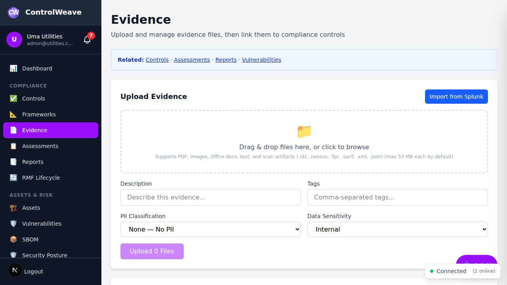
*Figure 4.4: Evidence upload interface*

3. Supported formats: PDF, DOCX, DOC, XLSX, XLS, JPG, JPEG, PNG, GIF, SARIF, NESSUS, CKL, FPR, XML, JSON, TXT, CSV, ZIP
4. Add description: "Information Security Policy v1.0"
5. Add tags: "policy", "access-control", "approved"
6. Click **Upload**

*Figure 4.5: Evidence uploaded successfully*

### 4.5 Mark as Implemented
1. Once evidence is uploaded and control is implemented
2. Edit implementation status
3. Change **Status** to "Implemented"
4. Click **Save**

**Congratulations!** 🎉 You've implemented your first control!

---

## Step 5: Run Your First Assessment

### 5.1 Navigate to Assessments
1. Click **Assessments** in left sidebar
2. Click **New Assessment**

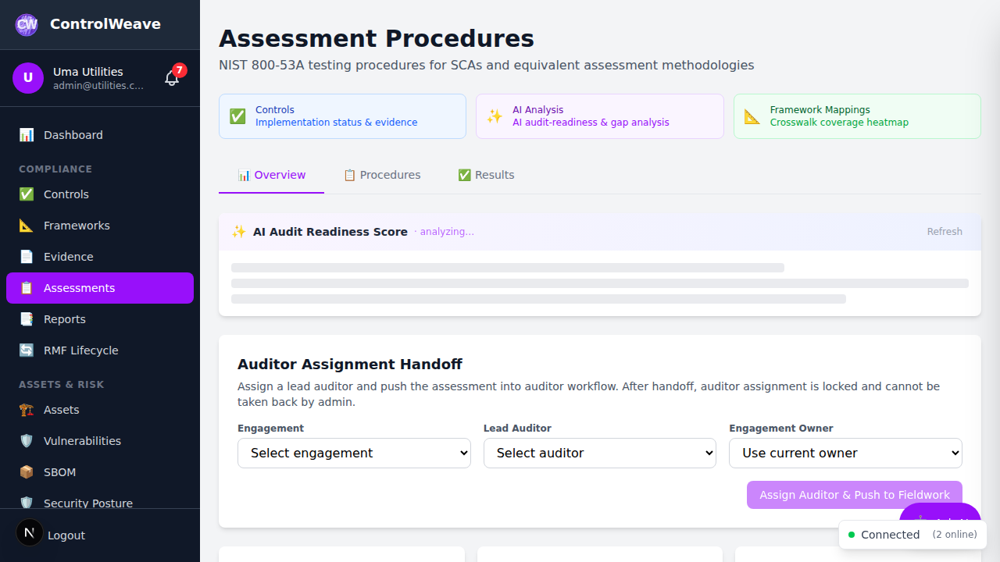
*Figure 5.1: Assessments list page*

### 5.2 Create Assessment
**Assessment Form**:
- **Control**: Select the control you just implemented
- **Assessment Type**: Choose "Self-Assessment"
- **Depth**: Select "Basic" (quickest)
- **Assessor**: Select yourself
- **Due Date**: Set for today or tomorrow

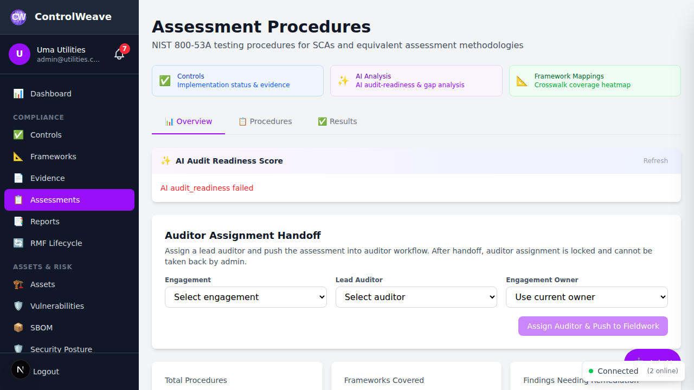
*Figure 5.2: Create new assessment form*

Click **Create Assessment**

### 5.3 Conduct Assessment
1. Assessment opens with procedure checklist
2. Review each procedure step
3. Check evidence (click link to view uploaded evidence)

*Figure 5.3: Conducting an assessment*

4. For each procedure:
   - ✅ **Satisfied**: Control meets requirement
   - ⚠️ **Other Than Satisfied**: Partial compliance or issues found
   - ⊘ **Not Applicable**: Procedure doesn't apply

*Figure 5.4: Assessment outcome options*

5. Add notes explaining your determination
6. Click **Save Results**

---

## Step 6: Explore the Dashboard

### 6.1 Dashboard Overview
Navigate back to **Dashboard** to see:

*Figure 6.1: Dashboard overview - Your compliance command center*

**Compliance Overview Panel**:
- Overall compliance percentage
- Number of controls by status
- Assessment completion rate

*Figure 6.2: Compliance overview panel*

**Framework Progress**:
- Pie charts showing compliance per framework
- Percentage complete for each active framework

*Figure 6.3: Framework progress visualization*

**Priority Actions**:
- Controls requiring attention
- Overdue assessments
- Missing evidence

*Figure 6.4: Priority actions requiring attention*

**Recent Activity**:
- Latest actions taken in the system

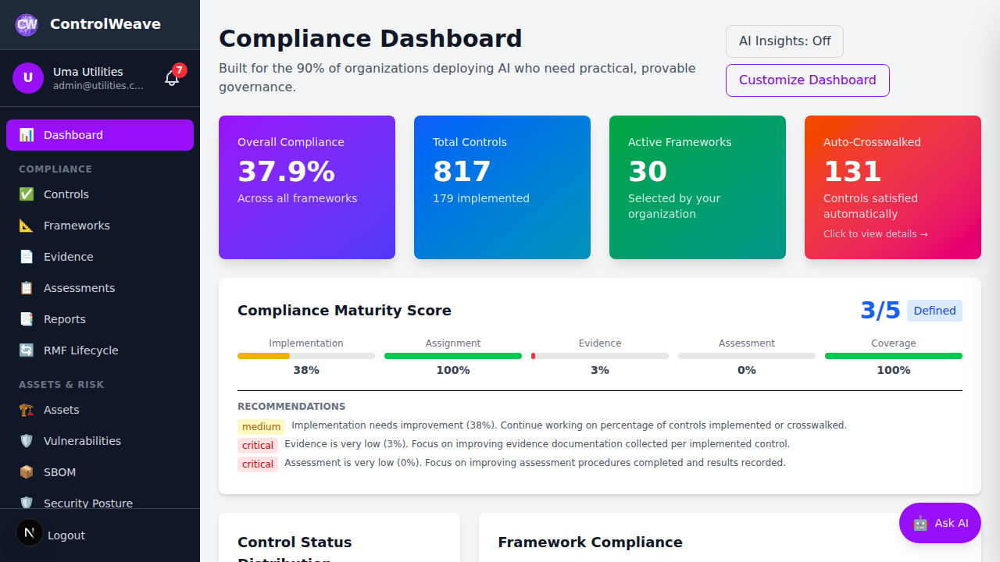
*Figure 6.5: Recent activity feed*

---

## Step 7: Set Up AI Features (Optional)

### 7.1 Configure LLM Provider
1. Go to **Settings** → **LLM Configuration**

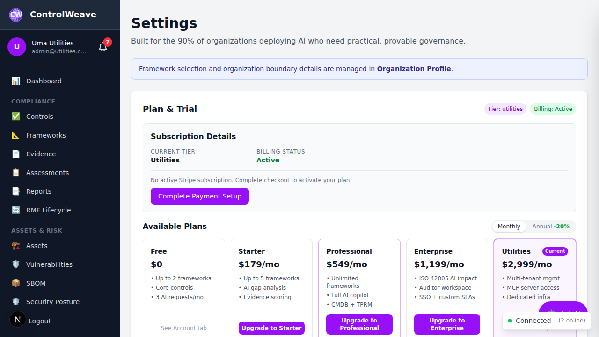
*Figure 7.1: LLM Configuration page*

2. Choose a provider

*Figure 7.2: Select your LLM provider*

3. Enter your API key

*Figure 7.3: Enter your API key*

4. Click **Test Connection**
5. Select default model

*Figure 7.4: Select your preferred model*

6. Click **Save**

**Provider Options**:

| Provider | Get Key From | Notes |
|----------|-------------|-------|
| **Google Gemini** | aistudio.google.com | FREE tier available! |
| **Groq** | console.groq.com | FREE tier available! |
| **Anthropic Claude** | console.anthropic.com | Best for analysis |
| **OpenAI** | platform.openai.com | Popular choice |
| **xAI Grok** | console.x.ai | Fast, capable models |
| **Ollama** | Local install | No key needed! |

> **💡 Tier Limits**:
> - Community: 10 AI requests/month
> - Pro: Unlimited
> - Enterprise: Unlimited

### 7.2 Try the AI Copilot
1. Look for purple **Ask AI** button (bottom-right of any page)

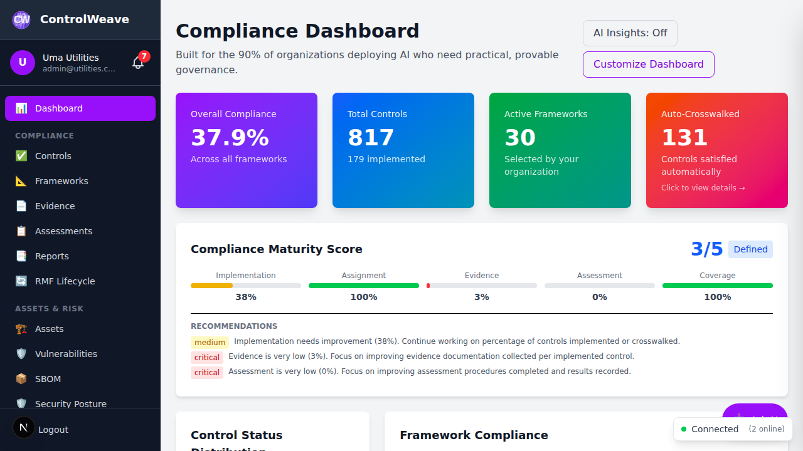
*Figure 7.5: AI Copilot button - Available on every page*

2. Click to open AI Copilot panel

*Figure 7.6: AI Copilot panel*

3. Try asking:
   - "What are my top compliance gaps?"
   - "What controls should I prioritize?"
   - "Explain NIST 800-53 AC-2 to me"

*Figure 7.7: Conversing with the AI Copilot*

---

## Step 8: Invite Your Team

### 8.1 Navigate to Users
1. Go to **Settings** → **Users**
2. Click **Invite User**

*Figure 8.1: User management page*

### 8.2 Set Up User
**User Form**:
- **Email**: Team member's email
- **Full Name**: Their name
- **Role**: Select appropriate role:
  - **Admin**: Full system access
  - **Manager**: Can edit controls, assessments
  - **Analyst**: Can view and update status
  - **Viewer**: Read-only access
  - **Auditor**: External auditor role (Pro+)

*Figure 8.2: Invite a new user*

*Figure 8.3: Select user role*

3. Click **Send Invitation**

---

## 🎯 Quick Wins (First 30 Minutes)

**✅ 5-Minute Quick Start**:
1. Register account
2. Activate 1-2 relevant frameworks
3. Explore dashboard

**✅ 15-Minute Setup**:
1. Everything above, plus:
2. Implement 1 policy control
3. Upload policy evidence
4. Run one assessment

**✅ 30-Minute Onboarding**:
1. Everything above, plus:
2. Configure AI
3. Run AI gap analysis
4. Invite one team member

---

## 📚 Next Steps

### Week 1
- [ ] Implement 5-10 high-priority controls
- [ ] Upload evidence for existing policies/procedures
- [ ] Complete assessments for implemented controls
- [ ] Review AI gap analysis recommendations

### Month 1
- [ ] Achieve 20% overall compliance
- [ ] Complete all high-priority controls
- [ ] Generate first compliance report
- [ ] Review crosswalk opportunities

---

## ✅ Onboarding Checklist

**Account Setup**:
- [ ] Account created
- [ ] Organization profile completed
- [ ] Data sensitivity profile configured

**Framework Configuration**:
- [ ] Relevant frameworks activated
- [ ] Framework details reviewed

**Control Management**:
- [ ] First control implemented
- [ ] Evidence uploaded
- [ ] Assessment completed

**AI Features** (Optional):
- [ ] LLM provider configured
- [ ] AI Copilot tested
- [ ] Gap analysis run

**Team Setup**:
- [ ] Team members invited
- [ ] Controls assigned

---

**Need Help?** Use the AI Copilot (purple button) or see [FAQ](FAQ.md)
