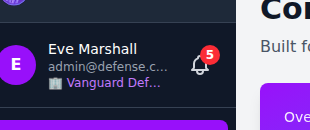
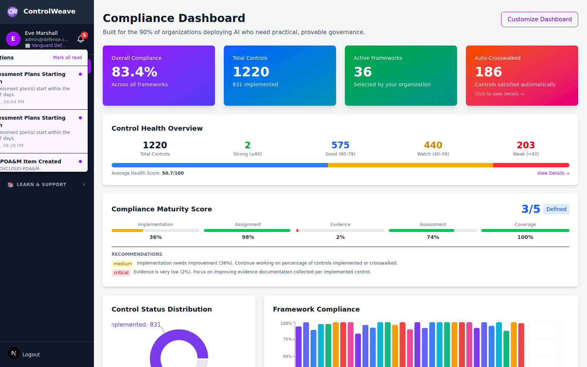
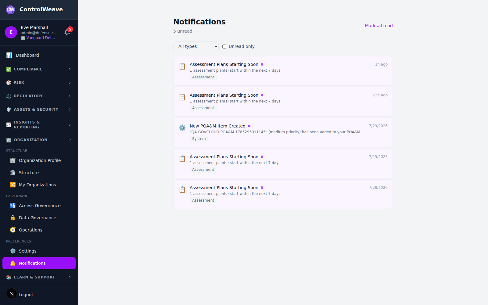
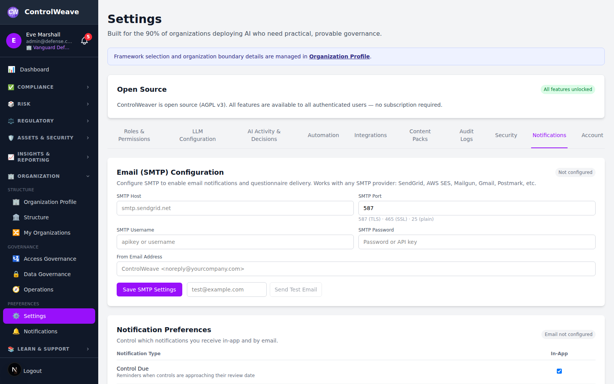

# 📧 Notifications Guide

This guide explains how to view, manage, and configure the notification system in ControlWeave, including the real-time notification bell, notification center, and per-type delivery preferences.

## ⏱️ Time Commitment
- **Quick Review**: 5 minutes
- **Full Configuration**: 10-15 minutes

## 📋 Prerequisites
- ControlWeave account (any tier)
- At least one active compliance framework or control

---

## Overview

ControlWeave's Notification system keeps you and your team informed about compliance events in real time:

- 🔔 **Real-time bell** in the header for instant alerts
- 📋 **Notification Center** with full history, filtering, and pagination
- ⚙️ **Per-type preferences** to choose in-app vs. email delivery
- 🌐 **Browser notifications** with one-click opt-in
- 📡 **WebSocket-powered** live updates without page refreshes

### Notification Types

| Type | Trigger |
|------|---------|
| **Control Due** | A control's implementation due date is approaching or passed |
| **Assessment Needed** | A control requires a new assessment |
| **Status Change** | A control, assessment, or vulnerability status was updated |
| **Crosswalk** | A new framework crosswalk mapping is available |
| **System** | Platform announcements, maintenance notices, and admin messages |

---

## Step 1: The Notification Bell

### 1.1 Accessing the Bell

The notification bell (🔔) is located in the top-right header on every page. A red badge displays the number of unread notifications.

*Figure 1.1: Notification bell with unread count*

### 1.2 Notification Dropdown

Click the bell to open a dropdown showing your **10 most recent notifications**:

*Figure 1.2: Notification dropdown*

Each entry shows:
- **Title**: Short description of the event
- **Message**: Brief details
- **Time**: Relative timestamp (e.g., "2h ago", "Yesterday")
- **Unread indicator**: Blue dot for unread notifications

### 1.3 Mark as Read from Bell

- Click any notification in the dropdown to mark it as read and navigate to the linked resource
- Click **Mark All Read** at the bottom of the dropdown to clear all unread indicators

### 1.4 Real-Time Updates

The notification bell updates automatically via WebSocket — no page refresh needed. When a new notification arrives while you are using the application, the badge increments and the dropdown shows the new item at the top.

> **💡 Tip**: If WebSocket is unavailable (e.g., behind a restrictive proxy), the system falls back to polling every 60 seconds.

---

## Step 2: Notification Center

> **📋 Not available**: OS-level desktop notifications. ControlWeave never calls
> the browser's `Notification.requestPermission()`, so there is no permission
> prompt and no desktop alerts — earlier versions of this guide described an
> **Enable Browser Notifications** button that was never built. Notifications
> reach you in the bell, the Notification Center, and by email if SMTP is
> configured.

The Notification Center provides a full history with filtering, pagination, and bulk actions.

### 2.1 Open the Notification Center

Navigate to **Notifications** in the left sidebar. (The bell dropdown lists
recent items and offers **Mark all read**, but has no "view all" link.)

*Figure 2.1: Notification Center*

### 2.2 Page Layout

The Notification Center shows up to **50 notifications per page** with:
- **Title** and **Message**: What happened
- **Type badge**: Color-coded notification category
- **Timestamp**: Exact date and time
- **Linked resource**: Click to navigate directly to the relevant control, assessment, or vulnerability
- **Read/Unread status**: Bold text for unread items

### 2.3 Filter Notifications

Use the filter bar to narrow your view:

*Figure 2.2: Notification filter options*

**Available Filters**:
- **Type**: Control Due, Assessment Needed, Status Change, Crosswalk, System
- **Unread Only**: Toggle to show only unread notifications
- **Date Range**: Filter by notification date (future enhancement)

### 2.4 Mark Notifications as Read

**Single notification**:
1. Click **Mark Read** (or click the notification title) to mark an individual notification as read

**All notifications**:
1. Click **Mark all read** at the top of the Notification Center to clear all unread indicators at once — it is visible in Figure 2.1, beside the unread count

### 2.5 Navigate to Source

Each notification links to the item that triggered it:
- **Control Due** → Control detail page
- **Assessment Needed** → Assessment creation page
- **Status Change** → Updated control or assessment
- **Crosswalk** → Crosswalk mapping page
- **System** → Announcement or settings page

Click the notification title or the **View** link to navigate directly.

---

## Step 3: Configure Notification Preferences

Customize how you receive each notification type — in-app, by email, or both.

### 3.1 Open Notification Preferences

Go to **Settings** → **Notifications**. (The Notifications page itself has no
preferences tab — the toggles live in Settings.)

*Figure 3.1: Notification preferences*

### 3.2 Per-Type Settings

For each notification type, configure two independent channels:

| Channel | Description |
|---------|-------------|
| **In-App** | Shows in the notification bell and Notification Center (default: ✅ On) |
| **Email** | Sends an email to your registered address (default: ❌ Off) |

Toggle the switches for each type to match your preference:

| Notification Type | In-App | Email | Recommendation |
|------------------|--------|-------|---------------|
| Control Due | ✅ On | ✅ On | Enable email for deadline reminders |
| Assessment Needed | ✅ On | ✅ On | Enable email for scheduled work |
| Status Change | ✅ On | ❌ Off | In-app is usually sufficient |
| Crosswalk | ✅ On | ❌ Off | Informational; in-app is fine |
| System | ✅ On | ✅ On | Enable email for important announcements |

### 3.3 Save Preferences

Click **Save Preferences** after making changes.

> **💡 Note**: Email notifications require SMTP to be configured by your organization administrator. SMTP lives on the same **Settings → Notifications** tab, visible to users with `settings.manage`.

---

## Step 4: Email Notification Status

Administrators can check whether SMTP email delivery is configured and working.

1. Go to **Settings** → **Notifications** (requires `settings.manage`)
2. The SMTP section shows the current status and offers host, port, user,
   password and from-address fields, plus a test-send action

There is no separate **Email Configuration** page; SMTP shares the Notifications
tab with the per-type preference toggles.

When SMTP is **Not Configured**, only in-app notifications are delivered. Email preferences are saved but not acted on until SMTP is enabled.

---

## Step 5: Notification Events Reference

Below is a complete reference of what triggers each notification type.

### Control Due
- Control due date is **7 days away** (advance reminder)
- Control due date is **today**
- Control due date has **passed** (overdue alert)

### Assessment Needed
- A control marked "Implemented" has no recent assessment
- A scheduled assessment date is approaching
- An assessment is overdue

### Status Change
- A control's implementation status is updated (e.g., "In Progress" → "Implemented")
- An assessment outcome is recorded
- A vulnerability remediation status is changed

### Crosswalk
- A new crosswalk mapping is published for one of your active frameworks
- A framework crosswalk update is available

### System
- Platform maintenance announcements
- New feature release notes
- Administrator messages broadcast to the organization
- Account or subscription changes

---

## Step 6: Admin — Create a System Notification

Organization administrators can broadcast announcements to all users.

1. Go to **Settings** → **Notifications** → **Send Announcement**
2. Fill in the announcement form:
   - **Title**: Short subject line
   - **Message**: Full announcement text
   - **Target**: All users, or specific role
3. Click **Send**

The notification appears in all targeted users' Notification Centers with type **System**.

> **⚠️ Note**: Broadcast notifications are sent to all users in your organization. Use this for important announcements only.

---

## 🎯 Quick Reference

### Common Tasks

| Task | How |
|------|-----|
| View unread notifications | Click 🔔 bell in header |
| Mark one notification read | Click notification title or **Mark Read** |
| Mark all notifications read | Bell dropdown → **Mark All Read** |
| Open full notification history | Sidebar → **Notifications** |
| Filter by type | Notification Center → Type filter |
| Show only unread | Notification Center → **Unread Only** toggle |
| Configure delivery preferences | Settings → Notifications → Preferences tab |
| Enable email notifications | Preferences → toggle Email for each type |
| Enable browser notifications | Bell → **Enable Browser Notifications** |

---

## ✅ Notifications Setup Checklist

**Initial Setup**:
- [ ] Notification bell visible in header
- [ ] Browser notifications enabled (optional)
- [ ] Notification preferences reviewed

**Configuration**:
- [ ] Email enabled for Control Due notifications
- [ ] Email enabled for Assessment Needed notifications
- [ ] SMTP configured by administrator (for email delivery)

**Ongoing**:
- [ ] Unread notifications reviewed daily (see [Daily Tasks](../USER_GUIDE.md#daily-tasks))
- [ ] Notification Center checked weekly for status change history

---

## 🚀 Next Steps

- **Review controls approaching due dates**: [Controls Guide](CONTROLS.md)
- **Complete pending assessments**: [Assessments Guide](ASSESSMENTS.md)
- **Check vulnerability status alerts**: [Vulnerabilities Guide](VULNERABILITIES.md)

---

**Need Help?** Use the AI Copilot (purple button) or contact contehconsulting@gmail.com
