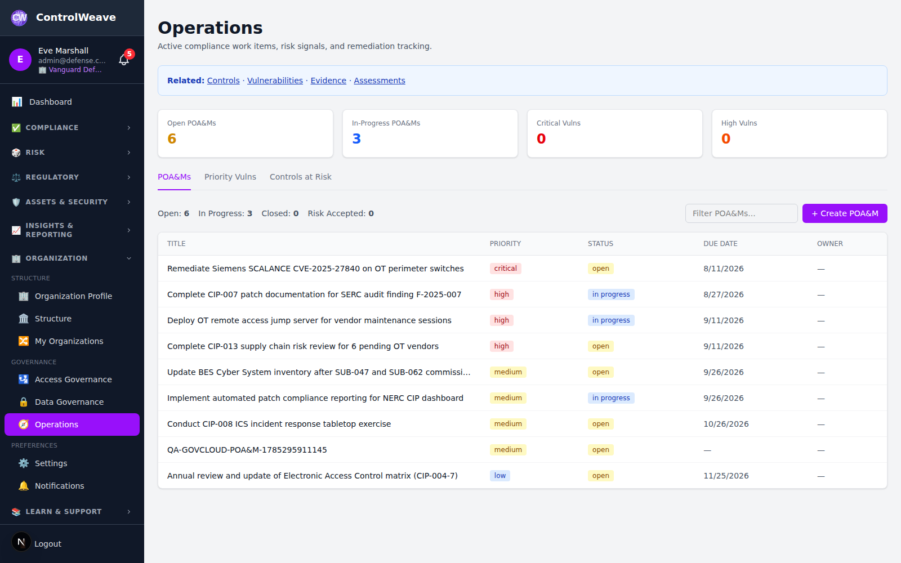
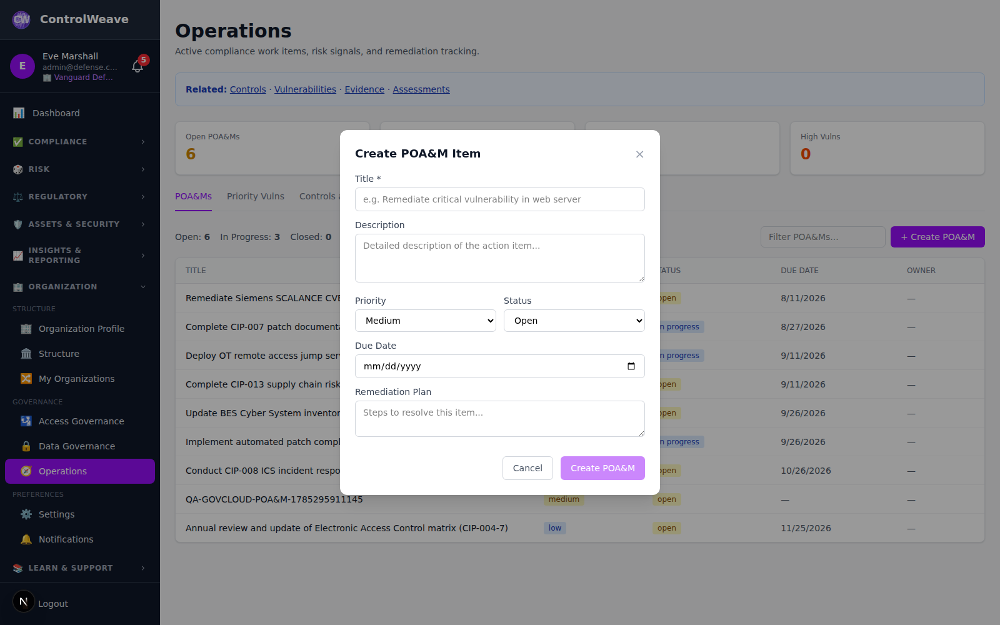

# 📝 POA&M Tracking Guide

Complete guide to managing Plans of Action & Milestones (POA&M) in ControlWeave.

## Overview

POA&M (Plan of Action & Milestones) items document weaknesses or deficiencies identified during assessments and the planned remediation steps to address them. This guide covers creating, tracking, updating, and closing POA&M items, including the auditor review workflow and framework-specific processes.

---

## Understanding POA&M

### What is a POA&M?

A **Plan of Action & Milestones** is a formal document that:
- Identifies a security or compliance weakness
- Describes the remediation plan
- Defines milestones and target completion dates
- Tracks progress toward resolution
- Provides an audit trail of remediation efforts

### When POA&M Items Are Created

POA&M items are created in three ways:

1. **Manually** — You create a POA&M for any identified weakness
2. **From Vulnerabilities** — Convert a tracked vulnerability into a POA&M
3. **Automatically** — System creates a POA&M when a control transitions from non-compliant to compliant status (requires auditor review)

---

## POA&M Statuses

| Status | Meaning |
|--------|---------|
| **Open** | Weakness identified, remediation not yet started |
| **In Progress** | Actively working on remediation |
| **Pending Auditor Review** | Remediation complete, awaiting auditor approval |
| **Auditor Approved** | Auditor confirmed remediation is satisfactory |
| **Auditor Rejected** | Auditor found remediation insufficient; rework required |
| **Closed** | Weakness fully remediated and verified |

### Status Workflow

```
Open → In Progress → Pending Auditor Review → Auditor Approved → Closed
                                            ↓
                                    Auditor Rejected → In Progress
```

---

## Viewing POA&M Items

### Access POA&M List

1. Click **Operations** in the left sidebar (under **Organization** — it
   requires the `settings.manage` permission)
2. The **POA&Ms** tab is selected by default and lists every POA&M item for your
   organization


*Figure 1: POA&M list — Your remediation tracking dashboard*

There is no dedicated POA&M page in the sidebar; POA&M shares the Operations
page with **Priority Vulns** and **Controls at Risk**.

### List View Columns

- **Title**: Brief description of the weakness
- **Priority**: Critical, High, Medium, or Low
- **Status**: Current remediation status
- **Due Date**: Current target completion date
- **Owner**: Assigned person

A running count of Open / In Progress / Closed / Risk Accepted items sits above
the table. Rows are not clickable — there is no POA&M detail view in the UI yet;
see [What is API-only today](#what-is-api-only-today).

### Filter & Search

A single **Filter POA&Ms...** box above the table narrows the list by text.
Filtering by status, priority, framework, owner, or date range is supported by
`GET /api/v1/poam` query parameters but is not yet exposed as a filter bar.


*Figure 2: Filter POA&M items*

---

## Creating a POA&M

### Create Manually

1. Go to **Operations** in the left sidebar
2. On the **POA&Ms** tab, click **+ Create POA&M**
3. Fill in the form:


*Figure 3: POA&M creation form*

**Required**:
- **Title**: Clear, concise description of the weakness

**Optional**:
- **Description**: Full details of the identified weakness or deficiency
- **Priority**: Low / Medium / High / Critical (defaults to Medium)
- **Status**: Open / In Progress / Pending Review / Closed / Risk Accepted
- **Due Date**: Target completion date
- **Remediation Plan**: Steps to address the weakness

4. Click **Create POA&M**

The create dialog covers the common fields. Owner, control linkage, milestones,
resources required, and the scheduled completion date are accepted by
`POST /api/v1/poam` but are not on the dialog — set them through the API for now.

### Create from Vulnerability

Converting a finding into a formal POA&M is available through the API:

```
POST /api/v1/poam/from-vulnerability/:vulnerabilityId
```

It pre-populates the POA&M from the vulnerability's details. There is no
**Create POA&M** button on the vulnerability detail panel — see the
[Vulnerability Management guide](../wiki/security/Vulnerability-Management.md),
which lists this among the things that panel does not do.

### Automatic POA&M Creation

`PUT /api/v1/controls/:id` will **automatically create a POA&M** in
`Pending Auditor Review` when a control transitions from non-compliant
(`not_started`, `in_progress`, `needs_review`) to compliant (`implemented`,
`satisfied_via_crosswalk`, `verified`). That route requires a
`poam_justification` in the request body and returns `400` with
`requires_poam_submission: true` without one.

> **📋 Note**: changing a control's status from the control detail page does
> **not** trigger this. The page calls the implementation status endpoint
> (`/api/v1/implementations/:id/status`), which has no POA&M logic, so no
> justification is requested and no POA&M is created. Automatic creation
> currently only happens for API clients calling `PUT /controls/:id`.

---

## Milestones, Resources, and Slippage

A POA&M is a *Plan of Action **and Milestones***, and the milestone half is tracked as its own list rather than folded into a single date.

### Milestones

Each POA&M item carries a list of discrete milestones, each with its own description, target date, and status:

| Status | Meaning |
|---|---|
| `pending` | not started |
| `in_progress` | underway |
| `completed` | done — the completion date is stamped automatically |
| `delayed` | target date passed without completion |
| `cancelled` | no longer applicable |

Marking a milestone **completed** stamps its completion date; reopening it clears that date, so the two can never contradict each other. The milestone list reports how many are completed and how many are overdue.

Milestones are ordered by an explicit sort order, so "inventory the affected systems" stays above "verify with an external scan" regardless of their dates.

### Resources Required

Records the funding, staff, and tooling estimated to close the item — for example *"1 FTE security engineer, 40h; $12k for load-balancer certificates"*. Federal POA&M templates require this because the estimate is what gets reviewed and budgeted against.

### Scheduled completion vs. due date — how slippage stays visible

These are two different dates and the difference is the point:

- **Scheduled completion date** — the **original** commitment. Set once, when the item is created, and not overwritten afterwards.
- **Due date** — the **current** target, which may be revised.

When a deadline moves, the due date changes and the scheduled completion date does not. The gap between them *is* the slippage, which is exactly what OMB-style reporting asks you to show. If a single date were revised in place, the fact that it had ever moved would be gone.

> **📋 Note**: POA&M items that existed before this was introduced have their scheduled completion date backfilled from their due date, so they report zero slippage rather than dropping out of slippage reporting entirely.

---

## Updating a POA&M

### Update Status

Set the status when you create the item, or change it afterwards with:

```
PATCH /api/v1/poam/:id
```

Valid statuses are `open`, `in_progress`, `pending_review`, `closed`, and
`risk_accepted`. Editing an existing POA&M from the UI is not yet available.

### Add Progress Updates

Document progress notes without changing status:

```
POST /api/v1/poam/:id/updates
```

**Good Update Notes Include**:
- What was completed
- What's remaining
- Any blockers or dependencies
- Revised timeline if needed

### Attach Evidence

Upload remediation evidence through the [Evidence module](EVIDENCE.md) and
reference it in the POA&M's remediation plan or a progress update. A dedicated
Evidence section on the POA&M itself is not yet available.

---

## Submitting for Auditor Review

When remediation is complete, submit the POA&M for auditor review.

### Standard Submission

```
POST /api/v1/poam/:id/submit-for-review
```

**Required**:
- **Justification**: Detailed explanation of how the weakness was remediated
- **Control** (if applicable): The control that was addressed
- **Status Change**: Previous and new control status

**Optional**:
- **Supporting Evidence**: Link evidence documents
- **Framework-Specific Data**: Additional fields for specific frameworks (see below)

4. Click **Submit for Review**

The POA&M status changes to `Pending Auditor Review`. Auditors are notified automatically.

---

## Framework-Specific POA&M Processes

ControlWeave supports specialized remediation documentation required by specific compliance frameworks. Select the appropriate **Framework-Specific Type** when submitting for review.

### FISCAM (Federal Information System Controls Audit Manual)

#### Corrective Action Plan (CAP)

For formal corrective action plans required by FISCAM:

**Required Fields**:
- **Root Cause**: Underlying cause of the control deficiency
- **Corrective Action**: Specific actions taken to address the root cause
- **Responsible Official**: Name and title of the accountable official
- **Target Completion Date**: When corrective action will be complete
- **Resources Required**: Budget, personnel, and tools needed

**Review Levels**: Auditor → Management → Independent Verification

#### Notice of Findings and Recommendations (NFR)

For formal notices of audit findings:

**Required Fields**:
- **Finding Description**: Detailed description of the audit finding
- **Recommendation**: Specific recommended actions
- **Management Response**: Organization's response to the finding
- **Estimated Completion Date**: Expected resolution date

**Review Levels**: Auditor → Auditee Management → Audit Committee

### ISO 27001

#### Corrective Action Request (CAR)

For non-conformities identified during ISO 27001 audits:

**Required Fields**:
- **Non-Conformity Description**: Description of the non-conformity
- **Corrective Action**: Actions to eliminate the cause
- **Preventive Action**: Actions to prevent recurrence
- **Verification Method**: How effectiveness will be confirmed

**Review Levels**: Auditor → Management Representative

#### Opportunity for Improvement (OFI)

For non-mandatory improvement recommendations:

**Required Fields**:
- **Improvement Area**: Area being improved
- **Proposed Action**: Recommended improvement
- **Expected Benefit**: Anticipated outcome

### SOC 2

#### Control Exception

For documented exceptions to SOC 2 requirements:

**Required Fields**:
- **Exception Rationale**: Why the exception is necessary
- **Compensating Controls**: Alternative controls in place
- **Risk Assessment**: Risk level of the exception
- **Remediation Plan**: Plan to eliminate the exception

#### Control Deficiency

For design or operational deficiencies:

**Required Fields**:
- **Deficiency Type**: Design deficiency or operational deficiency
- **Impact Assessment**: Potential impact of the deficiency
- **Remediation Steps**: Specific remediation actions
- **Testing Plan**: How remediation will be tested

### HIPAA

#### HIPAA Corrective Action Plan

For violations or compliance gaps involving Protected Health Information (PHI):

**Required Fields**:
- **Violation Description**: Nature of the HIPAA violation or gap
- **Affected PHI**: Type and scope of PHI involved
- **Corrective Measures**: Steps taken to correct the violation
- **Prevention Measures**: Actions to prevent recurrence
- **Compliance Date**: Date full compliance was achieved

### PCI DSS

#### Report on Attestation of Compliance (RAV)

For PCI DSS compliance gaps:

**Required Fields**:
- **Requirement Number**: Specific PCI DSS requirement
- **Gap Description**: Nature of the compliance gap
- **Remediation Approach**: How the gap will be addressed
- **Validation Method**: How compliance will be validated
- **Target Date**: Completion target

### NIST 800-53

#### NIST POA&M

Standard NIST-format POA&M:

**Required Fields**:
- **Weakness Description**: Description of the identified weakness
- **Risk Rating**: Risk level (Critical, High, Moderate, Low)
- **Remediation Steps**: Planned remediation actions
- **Milestones**: Specific milestones with dates
- **Resources**: Required budget and personnel
- **Scheduled Completion**: Planned completion date

### FedRAMP

#### FedRAMP POA&M

For agency authorization-specific findings:

**Required Fields**:
- **Weakness ID**: Unique identifier for the weakness
- **Risk Adjustment**: Risk level adjustment justification
- **Vendor Dependency**: Any dependency on third-party vendors
- **Milestone Changes**: Changes to milestone schedule
- **Deviation Request**: Request for deviation from standard requirements

---

## Auditor Review Workflow

*Requires the `audit.write` permission (`audit.read` for guidance)*

The auditor review workflow is fully implemented on the API and has no UI yet.
Everything below is reachable through the endpoints named; there is no auditor
queue screen, guidance panel, review form, or approval-history view in the
dashboard.

### Viewing POA&Ms Pending Review

```
GET /api/v1/poam?status=pending_review
```

### Getting Framework-Specific Guidance

```
GET /api/v1/poam/auditor-guidance/:frameworkCode/:typeCode
```

Guidance includes:
- Required fields to verify
- Review checklist specific to the framework type
- Multi-level review workflow

Use `GET /api/v1/poam/framework-types` to discover the valid framework and type
codes, and `GET /api/v1/poam/approval-request/:id/context` to pull the full
context for a single submission.

### Conducting the Review

```
POST /api/v1/poam/:id/review
```

**Review Outcomes**:
- **Approved**: Remediation is satisfactory; POA&M moves to `Auditor Approved`
- **Rejected**: Remediation is insufficient; POA&M returns to `In Progress`
- **Changes Requested**: Minor adjustments needed before approval

Include review comments in the request body — they are the actionable feedback
the POA&M owner receives.

### Viewing Approval History

```
GET /api/v1/poam/:id/approval-history
```

Returns every submission and outcome for the item, in order.

---

## What is API-only today

The POA&M data model and workflow are complete on the backend; the dashboard
currently surfaces only the list and the create dialog. These parts have no UI:

| Capability | Endpoint |
|---|---|
| POA&M detail view | `GET /api/v1/poam/:id` |
| Edit a POA&M / change status | `PATCH /api/v1/poam/:id` |
| Progress updates | `POST /api/v1/poam/:id/updates` |
| Submit for auditor review | `POST /api/v1/poam/:id/submit-for-review` |
| Auditor review decision | `POST /api/v1/poam/:id/review` |
| Approval history | `GET /api/v1/poam/:id/approval-history` |
| Auditor guidance | `GET /api/v1/poam/auditor-guidance/:frameworkCode/:typeCode` |
| Create from a vulnerability | `POST /api/v1/poam/from-vulnerability/:vulnerabilityId` |
| Milestones | `GET/POST/PATCH/DELETE /api/v1/poam/:id/milestones[/:milestoneId]` |

Filtering, status/priority selection, and framework-specific fields are likewise
supported by the API ahead of the UI. This guide describes the endpoints rather
than inventing buttons, so nothing here sends you looking for a control that is
not on screen.

---

## Closing a POA&M

Once an auditor approves the POA&M, you can close it:

1. Open the `Auditor Approved` POA&M
2. Click **Close POA&M**
3. Confirm closure

The POA&M status changes to `Closed` and is retained in the audit trail.

---

## POA&M Tips & Best Practices

### Creating Effective POA&Ms

**DO**:
✅ Be specific about the weakness and its impact
✅ Define realistic milestones with clear owners
✅ Link to the relevant control and framework
✅ Attach supporting evidence as you remediate
✅ Log progress updates regularly
✅ Use framework-specific types when applicable
✅ Provide detailed justification when submitting for review

**DON'T**:
❌ Use vague descriptions like "fix security issue"
❌ Set unrealistic target dates
❌ Leave POA&Ms in "In Progress" without updates
❌ Skip evidence attachment
❌ Submit for review without sufficient documentation

### Weekly Review Tasks

- Review all POA&M items for status updates
- Log progress on in-progress items
- Submit completed remediations for review
- Respond to auditor review outcomes
- Identify overdue items and escalate as needed

### Severity Guidance

| Severity | Remediation Timeline | Examples |
|----------|---------------------|----------|
| **Critical** | 30 days | Exposed credentials, active exploits, zero-day vulnerabilities |
| **High** | 90 days | Unpatched critical CVEs, missing MFA, inadequate access controls |
| **Medium** | 180 days | Incomplete policy documentation, outdated configurations |
| **Low** | 365 days | Minor process improvements, documentation gaps |

---

## Troubleshooting

### POA&M Not Visible

**Problem**: Expected POA&M not in the list

**Solutions**:
- Clear the **Filter POA&Ms...** text box — it may be hiding the item
- Verify you have `controls.read` permission, and `settings.manage` to reach the
  Operations page at all
- Refresh the page

### Submit for Review Fails

**Problem**: `POST /api/v1/poam/:id/submit-for-review` returns an error

**Possible Causes**:
- Missing required justification text
- Insufficient permissions (need `controls.write`)
- The item is already in a review state

### Auditor Review Not Receiving Notifications

**Problem**: Auditor not notified of new submissions

**Solutions**:
- Verify the auditor's notification settings are enabled (**Settings →
  Notifications**)
- Check that the user has the Auditor role with `audit.write` permission
- Contact an admin to verify notification configuration

### Framework-Specific Fields Not Accepted

**Problem**: `framework_specific_data` is rejected or ignored

**Solutions**:
- Pass a valid `framework_specific_type` alongside it — discover the valid codes
  with `GET /api/v1/poam/framework-types`
- Verify the framework is activated for your organization

---

## Quick Reference

### POA&M Status Transitions

| From | To | Action Required |
|------|----|----------------|
| Open | In Progress | Edit POA&M, update status |
| In Progress | Pending Auditor Review | Submit for Review with justification |
| Pending Auditor Review | Auditor Approved | Auditor approves |
| Pending Auditor Review | In Progress | Auditor rejects (rework needed) |
| Auditor Approved | Closed | Close the POA&M |

### Permissions

| Action | Required Permission |
|--------|-------------------|
| View POA&Ms | `controls.read` |
| Create/Update POA&Ms | `controls.write` |
| Submit for Review | `controls.write` |
| Review (Approve/Reject) | `audit.write` |
| View Auditor Guidance | `audit.read` |

ControlWeaver has no tier gating — POA&M tracking, the auditor review workflow, framework-specific types, from-vulnerability creation, and automated POA&M creation are all available to every authenticated user.

---

**Next Steps:**
- [Controls Guide](CONTROLS.md)
- [Assessments Guide](ASSESSMENTS.md)
- [Vulnerability Management](VULNERABILITIES.md)
- [AI Analysis](AI_ANALYSIS.md)
