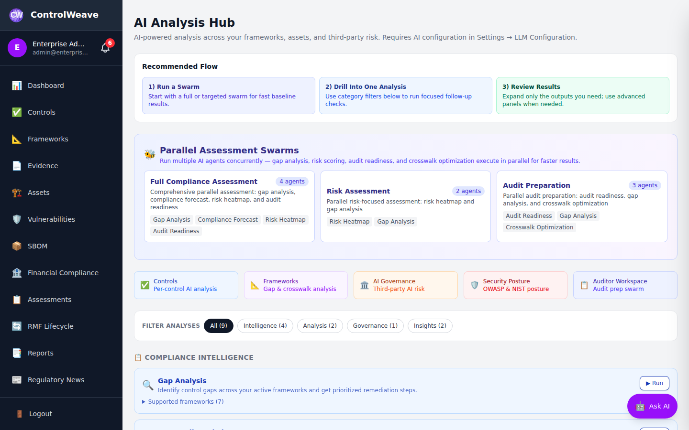
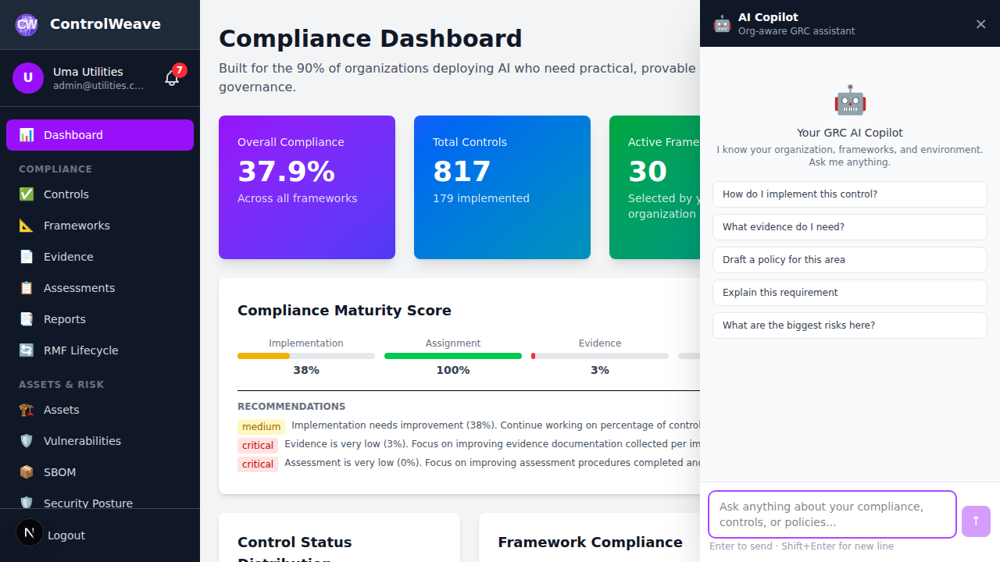

# 🔐 Vulnerability Management Guide

This guide covers how to track, manage, and remediate security vulnerabilities using ControlWeave's Vulnerability Management module.

## ⏱️ Time Commitment
- **Quick Setup**: 10 minutes
- **Full Configuration**: 30-45 minutes

## 📋 Prerequisites
- ControlWeave account with **Pro tier or higher**
- Assets registered in CMDB (Configuration Management Database)
- Basic understanding of CVE and CVSS scoring

---

## Overview

ControlWeave's Vulnerability Management helps you:
- 📊 Track vulnerabilities across your asset inventory
- 🎯 Prioritize remediation based on risk scores
- 🔄 Link vulnerabilities to controls and POA&Ms
- 📈 Monitor remediation progress
- 📝 Generate vulnerability reports for audits

### Tier Availability

| Feature | Community | Pro | Enterprise | Gov Cloud |
|---------|------|---------|--------------|------------|
| **Vulnerability Tracking** | ❌ | ✅ | ✅ | ✅ |
| **CVSS Scoring** | ❌ | ✅ | ✅ | ✅ |
| **POA&M Integration** | ❌ | ✅ | ✅ | ✅ |
| **Automated Scanning** | ❌ | ❌ | ✅ | ✅ |
| **SIEM Integration** | ❌ | ❌ | ❌ | ✅ |

---

## Step 1: Access Vulnerability Management

### 1.1 Navigate to Vulnerabilities
1. Click **CMDB** in the left sidebar
2. Select **Vulnerabilities** tab

Or use direct navigation:
1. Click **Vulnerabilities** in left sidebar (if available)

### 1.2 Dashboard Overview

The Vulnerability Dashboard displays:
- **Total Vulnerabilities**: Count of all tracked vulnerabilities
- **By Severity**: Breakdown by Critical/High/Medium/Low
- **By Status**: Open, In Progress, Resolved, Accepted Risk
- **Remediation Timeline**: Average time to resolve
- **Top Affected Assets**: Assets with most vulnerabilities

---

## Step 2: Understanding Vulnerability Data

### 2.1 Vulnerability Information

Each vulnerability tracks:
- **CVE ID**: Common Vulnerabilities and Exposures identifier (e.g., CVE-2024-1234)
- **Title**: Short description of the vulnerability
- **Description**: Detailed explanation of the issue
- **CVSS Score**: 0-10 severity rating
- **Severity**: Critical, High, Medium, Low
- **Affected Asset**: Which system/software is vulnerable
- **Discovery Date**: When vulnerability was identified
- **Status**: Current remediation status
- **Assigned To**: Person responsible for remediation
- **Due Date**: Target remediation date

### 2.2 CVSS Scoring

CVSS (Common Vulnerability Scoring System) provides standardized severity ratings:

| Score | Severity | Action Required |
|-------|----------|-----------------|
| **9.0-10.0** | Critical | Immediate action (24-48 hours) |
| **7.0-8.9** | High | Urgent action (7-14 days) |
| **4.0-6.9** | Medium | Planned remediation (30-60 days) |
| **0.1-3.9** | Low | Scheduled maintenance (90 days) |

### 2.3 Vulnerability Lifecycle

```
Discovered → Triaged → In Progress → Remediated → Verified → Closed
                ↓
            Accepted Risk (with justification)
```

---

## Step 3: Adding Vulnerabilities

### 3.1 Manual Entry

To manually add a vulnerability:

1. Click **Add Vulnerability**
2. Fill in the form:

**Required Fields**:
- **CVE ID**: Enter CVE identifier (or use custom ID)
- **Title**: Brief description
- **Affected Asset**: Select from CMDB assets
- **CVSS Score**: Enter score (0-10) or calculate
- **Discovery Date**: When vulnerability was found

**Optional Fields**:
- **Description**: Detailed explanation
- **Exploit Available**: Yes/No
- **Patch Available**: Yes/No/Partial
- **References**: Links to CVE database, vendor advisories
- **CWE**: Common Weakness Enumeration category
- **Assigned To**: Team member responsible
- **Due Date**: Target remediation date

3. Click **Save Vulnerability**

### 3.2 Import from Scanner

Import vulnerabilities from security scanning tools:

1. Click **Import** → **From Scanner**
2. Select scanner type:
   - Nessus
   - Qualys
   - OpenVAS
   - Rapid7 Nexpose
   - Custom CSV

3. Upload scan results file
4. Map fields (if custom format)
5. Review preview
6. Click **Import Vulnerabilities**

### 3.3 SBOM Integration

Import vulnerabilities from Software Bill of Materials:

1. Navigate to **CMDB** → **SBOM**
2. Select an asset with SBOM data
3. Click **Scan for Vulnerabilities**
4. ControlWeave checks components against CVE databases
5. New vulnerabilities are automatically created

---

## Step 4: Managing Vulnerabilities

### 4.1 View Vulnerability Details

Click any vulnerability to view full details.

**Available Actions**:
- **Edit**: Update vulnerability information
- **Assign**: Assign to team member
- **Link to Control**: Associate with security control
- **Create POA&M**: Generate Plan of Action & Milestone
- **Add Comment**: Document investigation or remediation steps
- **Upload Evidence**: Attach patches, configs, test results
- **Change Status**: Update remediation status
- **Accept Risk**: Document decision to accept vulnerability

### 4.2 Prioritize Vulnerabilities

Use filters and sorting to prioritize:

1. **Sort by Severity**: View Critical/High first
2. **Filter by Status**: Focus on "Open" vulnerabilities
3. **Filter by Asset**: Group by system or application
4. **Sort by Due Date**: See approaching deadlines
5. **Filter by Exploit Available**: Prioritize exploitable vulnerabilities

### 4.3 Assign Vulnerabilities

Assign vulnerabilities to team members:

1. Open vulnerability detail
2. Click **Assign**
3. Select team member from dropdown
4. Optionally set due date
5. Add assignment notes
6. Click **Assign**

Assigned user receives notification.

### 4.4 Bulk Operations

Perform actions on multiple vulnerabilities:

1. Select multiple vulnerabilities (checkbox)
2. Click **Bulk Actions**
3. Choose action:
   - **Bulk Assign**: Assign all to same person
   - **Bulk Status Update**: Change status for all
   - **Bulk Export**: Export selected to CSV
   - **Bulk Delete**: Remove selected (use cautiously)

---

## Step 5: Remediation Workflow

### 5.1 Standard Remediation Process

**Step 1: Triage**
1. Review vulnerability details
2. Verify affected asset
3. Confirm CVSS score
4. Check if exploit exists
5. Update status to "Triaged"

**Step 2: Plan Remediation**
1. Research available patches/mitigations
2. Assess impact of remediation
3. Create POA&M (if needed)
4. Set due date based on severity
5. Assign to responsible party
6. Update status to "In Progress"

**Step 3: Implement Fix**
1. Apply patch or implement mitigation
2. Document changes made
3. Upload evidence (patch confirmation, configs)
4. Update status to "Remediated"

**Step 4: Verification**
1. Re-scan to confirm fix
2. Test functionality
3. Review evidence
4. Update status to "Verified"

**Step 5: Close**
1. Final review and approval
2. Update status to "Closed"
3. Document lessons learned

### 5.2 Create POA&M from Vulnerability

Link vulnerability to Plan of Action & Milestone:

1. Open vulnerability detail
2. Click **Create POA&M**

3. Form is pre-filled with vulnerability data:
   - Title from vulnerability title
   - Description from vulnerability details
   - Severity from CVSS score
   - Affected asset pre-selected

4. Add remediation plan details:
   - **Milestones**: Breakdown of remediation steps
   - **Resources Required**: Team, tools, budget
   - **Target Date**: Final completion date
   - **Responsible Party**: Owner

5. Click **Create POA&M**

The vulnerability and POA&M are now linked.

### 5.3 Accept Risk

If remediation is not feasible, document risk acceptance:

1. Open vulnerability detail
2. Click **Accept Risk**

3. Provide justification:
   - **Business Rationale**: Why accepting risk
   - **Compensating Controls**: Alternative protections
   - **Risk Owner**: Who approved decision
   - **Review Date**: When to reassess
   - **Conditions**: Under what circumstances to remediate

4. Click **Accept Risk**

> **⚠️ Important**: Risk acceptance requires appropriate authorization (typically Manager or Admin role).

---

## Step 6: Link to Controls

### 6.1 Associate with Security Controls

Link vulnerabilities to relevant security controls:

1. Open vulnerability detail
2. Click **Link to Control**
3. Search for relevant control (e.g., SI-2 Flaw Remediation)
4. Select control from search results
5. Add notes explaining relationship
6. Click **Link**

**Common Control Mappings**:
- **SI-2** (Flaw Remediation) - Patching vulnerabilities
- **RA-5** (Vulnerability Scanning) - Discovering vulnerabilities
- **CM-3** (Configuration Change Control) - Managing patch deployment
- **CA-7** (Continuous Monitoring) - Ongoing vulnerability tracking

### 6.2 View Control Impact

See how vulnerabilities affect control compliance:

1. Navigate to **Controls**
2. View control with linked vulnerabilities
3. Control shows:
   - Number of associated vulnerabilities
   - Highest severity vulnerability
   - Impact on control status

---

## Step 7: Reporting & Analytics

### 7.1 Vulnerability Dashboard

View summary metrics:

**Key Metrics**:
- **Open Vulnerabilities by Severity**
- **Mean Time to Remediate (MTTR)**
- **Vulnerability Trend**: New vs. Closed over time
- **Top Affected Assets**
- **Remediation Rate**: Percentage closed on time
- **Risk Score**: Aggregate organizational risk

### 7.2 Generate Reports

Create vulnerability reports:

1. Click **Reports** → **Vulnerabilities**
2. Select report type:
   - **Executive Summary**: High-level overview
   - **Detailed Vulnerability Report**: Full listing
   - **Remediation Status**: Progress tracking
   - **Asset Vulnerability Matrix**: Vulnerabilities by asset
   - **Trend Analysis**: Historical data

3. Configure filters:
   - Date range
   - Severity levels
   - Status
   - Assigned to
   - Affected assets

4. Choose format: PDF, XLSX, CSV
5. Click **Generate Report**

### 7.3 Vulnerability Aging

Track how long vulnerabilities remain open:

**Aging Buckets**:
- **0-7 days**: New vulnerabilities
- **8-30 days**: Actively being remediated
- **31-60 days**: Aging vulnerabilities (review needed)
- **61-90 days**: Old vulnerabilities (escalate)
- **90+ days**: Stale vulnerabilities (critical review)

---

## Step 8: Automation & Integration

### 8.1 Automated Scanning (Enterprise+)

Configure automatic vulnerability scanning:

1. Go to **Settings** → **Integrations** → **Vulnerability Scanners**
2. Click **Add Scanner**
3. Select scanner type:
   - Nessus
   - Qualys
   - Rapid7
   - Custom API

4. Enter connection details:
   - **API URL**: Scanner API endpoint
   - **API Key**: Authentication credential
   - **Scan Schedule**: Frequency (daily, weekly)

5. Map severity levels
6. Configure auto-import settings
7. Click **Test Connection**
8. Click **Save**

### 8.2 Webhook Notifications

Set up webhooks for vulnerability events:

1. Go to **Settings** → **Webhooks**
2. Click **Add Webhook**
3. Configure webhook:
   - **URL**: Your webhook endpoint
   - **Events**: Select triggers
     - New vulnerability discovered
     - Vulnerability status changed
     - Critical vulnerability detected
     - Remediation overdue

4. Choose format: JSON or XML
5. Add authentication (if required)
6. Click **Test Webhook**
7. Click **Save**

### 8.3 SIEM Integration (Enterprise+)

Integrate with Security Information and Event Management systems:

1. Navigate to **Settings** → **SIEM Integration**
2. Select SIEM platform:
   - Splunk
   - IBM QRadar
   - Azure Sentinel
   - Elastic Security

3. Configure connection
4. Enable real-time vulnerability feed
5. Map vulnerability data to SIEM fields

---

## Step 9: Best Practices

### 9.1 Remediation Timelines

Follow industry-standard remediation timelines:

| Severity | Timeline | Actions |
|----------|----------|---------|
| **Critical** | 24-48 hours | Immediate patching, emergency change |
| **High** | 7-14 days | Prioritized patching, scheduled maintenance |
| **Medium** | 30-60 days | Planned patching, next maintenance window |
| **Low** | 90 days | Regular patching cycle |

### 9.2 Documentation Requirements

For each vulnerability, document:
- **Discovery Method**: How vulnerability was found
- **Affected Systems**: Complete asset list
- **Remediation Plan**: Detailed steps to fix
- **Testing Results**: Verification of fix
- **Lessons Learned**: How to prevent similar issues

### 9.3 Triage Criteria

Prioritize based on:
1. **CVSS Score**: Higher scores first
2. **Exploit Available**: Exploitable vulnerabilities first
3. **Asset Criticality**: Production systems first
4. **Data Sensitivity**: Systems with sensitive data first
5. **Internet Exposure**: Public-facing systems first

### 9.4 Regular Reviews

Conduct regular vulnerability reviews:
- **Daily**: Review new Critical/High vulnerabilities
- **Weekly**: Review all open vulnerabilities
- **Monthly**: Review accepted risks
- **Quarterly**: Analyze trends and metrics

---

## Step 10: AI-Assisted Vulnerability Management

### 10.1 AI Gap Analysis

Use AI to analyze vulnerability patterns:

1. Click **AI Analysis** → **Vulnerability Gap Analysis**
2. AI reviews:
   - Open vulnerabilities
   - Affected assets
   - Linked controls
   - Historical remediation data

3. Receive recommendations:
   - Priority vulnerabilities to address
   - Control gaps contributing to vulnerabilities
   - Remediation strategies
   - Resource allocation suggestions


*Figure 10.1: AI vulnerability gap analysis*

### 10.2 Ask AI Copilot

Use the AI Copilot for vulnerability questions:

**Example Questions**:
- "What are my most critical open vulnerabilities?"
- "Which assets have the most vulnerabilities?"
- "What controls should I implement to reduce vulnerability risk?"
- "Show me vulnerabilities that have been open for over 60 days"
- "What's the average time to remediate High severity vulnerabilities?"


*Figure 10.2: AI Copilot vulnerability query*

---

## 🎯 Quick Start Workflow

**First 15 Minutes**:
1. Import existing vulnerability scan results
2. Review Critical and High severity items
3. Assign top 5 vulnerabilities to team members
4. Set due dates based on severity

**First Week**:
1. Link vulnerabilities to relevant controls
2. Create POA&Ms for complex remediations
3. Set up automated scanner integration
4. Generate initial vulnerability report

**Ongoing**:
1. Daily review of new vulnerabilities
2. Weekly team review of open items
3. Monthly metrics review
4. Quarterly trend analysis

---

## ✅ Vulnerability Management Checklist

**Setup**:
- [ ] Vulnerability tracking enabled
- [ ] Scanner integration configured
- [ ] Team members assigned roles
- [ ] Remediation timelines defined

**Ongoing Operations**:
- [ ] Regular vulnerability scans running
- [ ] New vulnerabilities triaged within 24 hours
- [ ] Critical vulnerabilities remediated within SLA
- [ ] All open vulnerabilities have owners and due dates
- [ ] Accepted risks reviewed quarterly

**Integration**:
- [ ] Vulnerabilities linked to relevant controls
- [ ] POA&Ms created for complex issues
- [ ] SBOM scans automated
- [ ] Webhooks configured for notifications

**Reporting**:
- [ ] Monthly vulnerability reports generated
- [ ] Metrics tracked and trending
- [ ] Executive summaries provided
- [ ] Audit evidence documented

---

## 🚀 Next Steps

After setting up Vulnerability Management:

1. **Configure CMDB**: [Set up asset inventory](CMDB.md)
2. **Link to Controls**: [Map to security controls](CONTROLS.md)
3. **Create POA&Ms**: [Track remediation plans](POAM.md)
4. **Generate Reports**: [Vulnerability reporting](REPORTS.md)

---

## 📚 Additional Resources

- [NIST SP 800-40r4](https://csrc.nist.gov/publications/detail/sp/800-40/rev-4/final) - Guide to Enterprise Patch Management
- [CVE Database](https://cve.mitre.org/) - Common Vulnerabilities and Exposures
- [CVSS Calculator](https://www.first.org/cvss/calculator/) - Calculate CVSS scores
- [NVD](https://nvd.nist.gov/) - National Vulnerability Database

---

**Need Help?** Use the AI Copilot (purple button) or contact contehconsulting@gmail.com

> **💡 Pro Tip**: Integrate vulnerability management with your CI/CD pipeline to catch vulnerabilities before they reach production!
