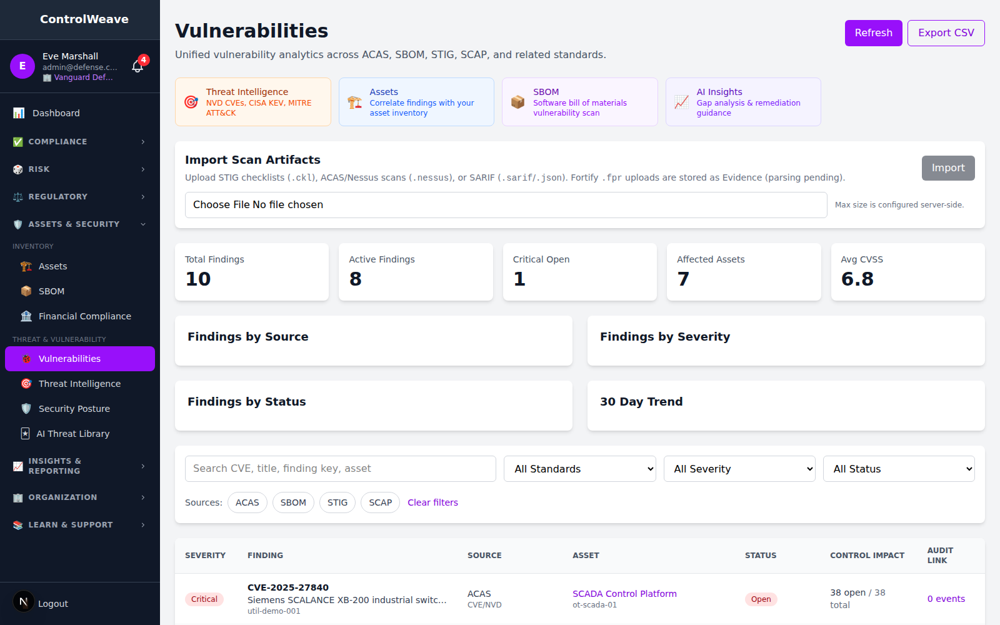
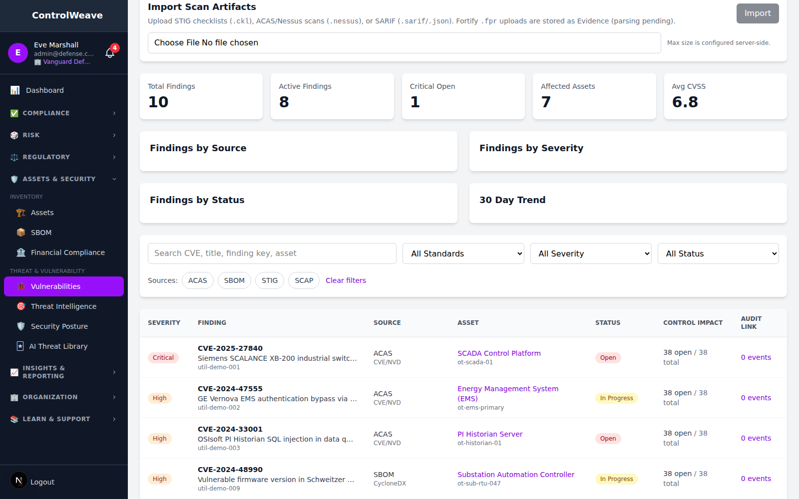
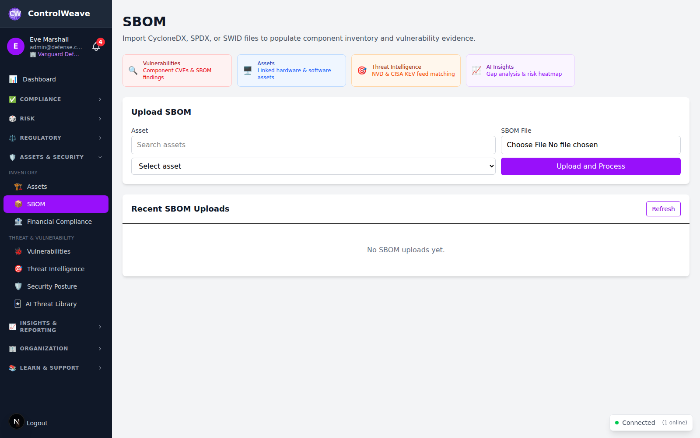
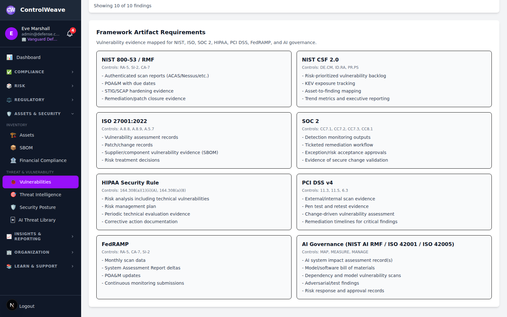
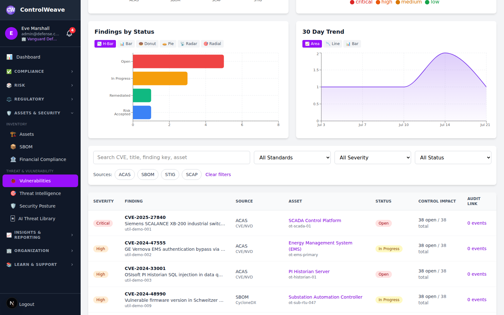
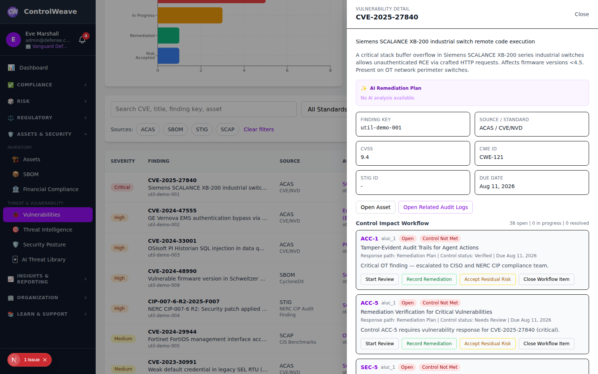
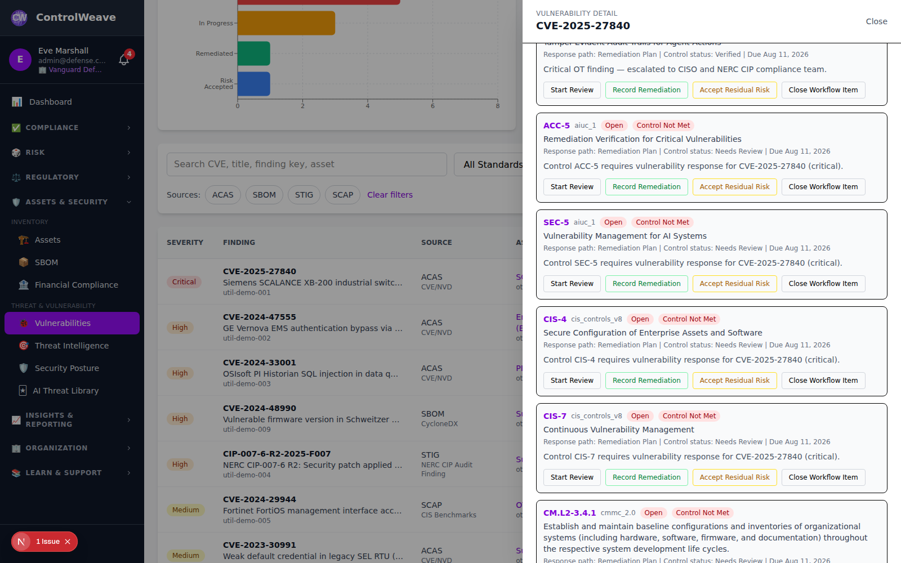
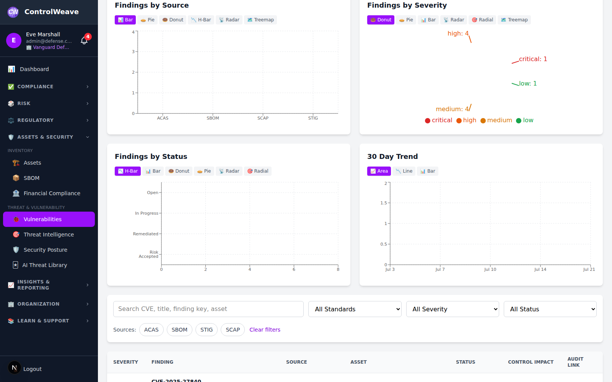
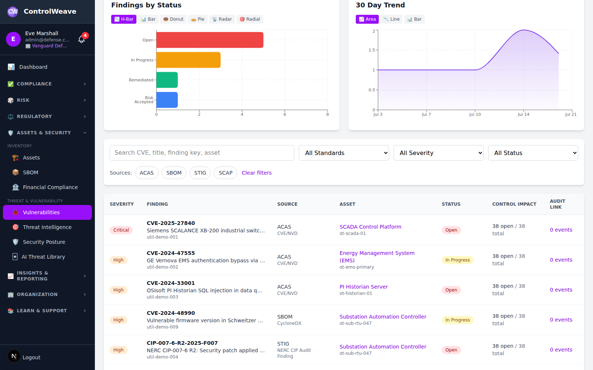

# 🔐 Vulnerability Management Guide

How to ingest, triage, and remediate security findings using ControlWeave's
Vulnerability Management module.

Screenshots in this guide were captured from a running instance against seeded
demo data.

> This page and [`docs/guides/VULNERABILITIES.md`](../../guides/VULNERABILITIES.md)
> are published to different places (the GitHub Wiki and the guides index) and
> carry the same content. Change both together.

## ⏱️ Time Commitment

- **First import and triage**: 10 minutes
- **Working through a finding's control impact**: 20-30 minutes

## 📋 Prerequisites

- A ControlWeave account with `assets.read` (to view findings) and
  `evidence.write` (to import scan artifacts)
- Assets registered in the CMDB, so findings can be correlated to systems
- A scan artifact to import — a STIG checklist, an ACAS/Nessus scan, or a SARIF
  report
- Basic familiarity with CVE and CVSS

---

## Overview

Vulnerability Management is a **unified analytics view over imported scan
artifacts**. It answers "what did our scanners find, which assets are affected,
and which controls does that put at risk."

What it does:

- 📥 Ingests findings from ACAS/Nessus, STIG checklists, SARIF, and SBOM
  component scans
- 📊 Aggregates them by source, severity, and status, with a 30-day trend
- 🔗 Derives **control impact** — which framework controls each finding puts at
  risk — and tracks a per-control response workflow
- 📐 Maps scan artifacts to the framework requirements they satisfy
- ✨ Generates a per-finding AI remediation plan when an AI provider is
  configured

What it is **not**: findings are not entered by hand and are not assigned to
individual users. Ingestion is by import; ownership is tracked per control
through the Control Impact Workflow. See
[Not currently in the product](#not-currently-in-the-product) before planning
around a capability.

No tier gating — every capability described here is available to every
authenticated user with the permissions listed above.

---

## Step 1: Open Vulnerability Management

In the left sidebar, expand **Assets & Security**, then under **Threat &
Vulnerability** choose **Vulnerabilities**.


*Figure 1.1: Vulnerability Management dashboard*

Four shortcuts across the top link to the related modules that feed or consume
this data — **Threat Intelligence** (NVD CVEs, CISA KEV, MITRE ATT&CK),
**Assets** (correlate findings with inventory), **SBOM** (component
vulnerability scan), and **AI Insights** (gap analysis and remediation
guidance).

### Summary statistics

| Tile | Meaning |
|---|---|
| **Total Findings** | Every finding ingested for your organization |
| **Active Findings** | Findings not yet remediated, accepted, or closed |
| **Critical Open** | Open findings at critical severity |
| **Affected Assets** | Distinct assets with at least one finding |
| **Avg CVSS** | Mean CVSS base score across findings |

---

## Step 2: Understanding Finding Data

Each finding carries:

- **Finding key** — the stable identifier from the source artifact
- **Severity** — Critical, High, Medium, Low
- **CVE ID and title** — where the source provides them
- **Source / standard** — e.g. `ACAS / CVE/NVD`, `STIG / NERC CIP Audit
  Finding`, `SBOM / CycloneDX`, `SCAP / CIS Benchmarks`
- **CVSS** — base score
- **CWE ID** — weakness classification, where provided
- **STIG ID** — for STIG-sourced findings
- **Asset** — the affected system, linked to its CMDB record
- **Status** — Open, In Progress, Remediated, Risk Accepted, Closed
- **Due date**
- **Control impact** — open/total count of affected control work items
- **Audit link** — related audit-log events

There is no per-finding assignee field. Responsibility is tracked on the
individual control work items in Step 4.

### CVSS scoring

CVSS provides standardized severity ratings. ControlWeave displays the base
score; use it to drive your remediation clock:

| Score | Severity | Typical action window |
|-------|----------|-----------------------|
| **9.0-10.0** | Critical | Immediate (24-48 hours) |
| **7.0-8.9** | High | Urgent (7-14 days) |
| **4.0-6.9** | Medium | Planned (30-60 days) |
| **0.1-3.9** | Low | Scheduled maintenance (90 days) |

### Finding lifecycle

```
Imported → Reviewed → Remediated → Closed
              ↓
        Risk Accepted (with justification)
```

Status transitions are driven by the workflow actions in Step 4, not by editing
a status field directly.

---

## Step 3: Import Scan Artifacts

Findings enter ControlWeave by import. Scroll to **Import Scan Artifacts**,
choose a file, and select **Import**.


*Figure 3.1: Importing a scan artifact*

Supported formats:

| Format | Extension | Handling |
|---|---|---|
| STIG checklist | `.ckl` | Parsed into findings |
| ACAS / Nessus scan | `.nessus` | Parsed into findings |
| SARIF | `.sarif`, `.json` | Parsed into findings |
| Fortify | `.fpr` | Stored as Evidence; parsing not yet implemented |

Maximum upload size is configured server-side. Importing requires
`evidence.write`.

SBOM component vulnerabilities arrive separately, through the SBOM module rather
than this panel:


*Figure 3.2: SBOM component vulnerability scanning*

### Framework artifact requirements

Below the charts, **Framework Artifact Requirements** shows which scan artifacts
each framework expects and whether you have supplied them — useful for knowing
what to import before an assessment.


*Figure 3.3: Artifact requirements by framework*

---

## Step 4: Triage and Remediate

### 4.1 Filter to what matters

Use the search box (CVE, title, finding key, or asset), the standard and status
selectors, and the source chips — **ACAS**, **SBOM**, **STIG**, **SCAP** — to
narrow the list. **Clear filters** resets everything.


*Figure 4.1: Filtering findings*

### 4.2 Open a finding

Select any row to open the detail panel.


*Figure 4.2: Finding detail*

The panel gives you **Open Asset** to jump to the affected system's CMDB record,
and **Open Related Audit Logs** to see the audit events tied to this finding.

### 4.3 Work the control impact

The **Control Impact Workflow** is where remediation is actually tracked. Each
affected control gets its own work item showing the control ID, its response
path, control status, and due date.


*Figure 4.3: Control Impact Workflow*

Each work item offers four actions:

| Action | Use it to |
|---|---|
| **Start Review** | Move the item into review — you are assessing the impact on this control |
| **Record Remediation** | Capture that the fix has been applied for this control |
| **Accept Residual Risk** | Accept the risk for this control instead of remediating, with justification |
| **Close Workflow Item** | Close the item once the response is complete and verified |

Updating a work item requires `controls.write`. The counter beside the heading
tracks open / in progress / resolved across the finding's controls.

### 4.4 A workable process

1. **Triage** — open the finding, confirm the asset and CVSS, check whether a
   public exploit exists, then **Start Review** on the affected controls.
2. **Plan** — research the patch or mitigation, assess the change's own impact,
   and note the due date the severity implies.
3. **Fix** — apply the patch or mitigation and upload confirming evidence
   through the Evidence module.
4. **Record** — **Record Remediation** on each control the fix addresses.
5. **Verify** — re-import the scanner artifact and confirm the finding no longer
   appears, or that its severity has dropped.
6. **Close** — **Close Workflow Item** for each control.

Where you cannot remediate, use **Accept Residual Risk** and write the
justification. An accepted risk with no rationale will not survive an audit.

---

## Step 5: Reporting and Analytics

### 5.1 Built-in charts

Findings by source, by severity, and by status each render as your choice of
bar, pie, donut, horizontal bar, radar, radial, or treemap.


*Figure 5.1: Findings by source and severity*

### 5.2 Trend over time

**30 Day Trend** shows finding volume over the last 30 days as an area, line, or
bar chart — the fastest read on whether you are gaining or losing ground.


*Figure 5.2: 30-day finding trend*

### 5.3 Export

**Export CSV** downloads the current filtered finding set. Filter first, then
export — the export honors your filters. For anything beyond a CSV, build the
report in the Reports module from the exported data.

---

## Step 6: AI Remediation Plans

When an AI provider is configured, opening a finding requests a remediation plan
for it automatically. The plan appears in the detail panel under **AI
Remediation Plan**.

Requesting a plan needs the `ai.use` permission. With no provider configured the
panel reads **"No AI analysis available."** — visible in Figure 4.2, which was
captured without an API key. AI is optional; everything else in this guide works
without it.

Configure a provider in **Settings → AI Configuration**. ControlWeave is
bring-your-own-key; see the [Settings guide](../../guides/SETTINGS.md).

---

## Step 7: Best Practices

### 7.1 Remediation timelines

Set internal SLAs by severity and hold to them:

| Severity | Target |
|---|---|
| Critical | 24-48 hours |
| High | 7-14 days |
| Medium | 30-60 days |
| Low | 90 days |

### 7.2 Documentation requirements

For each finding, keep: what was found and by which scanner, what you did about
it, evidence that the fix landed, and — if you accepted the risk — who accepted
it and why. The Control Impact Workflow plus Evidence uploads cover this.

### 7.3 Triage criteria

Prioritize by more than CVSS alone:

- Is the asset internet-facing?
- Does a public exploit exist? Check **Threat Intelligence** for CISA KEV.
- Does the asset process regulated or sensitive data?
- How many controls does the finding put at risk? The **Control Impact** column
  answers this directly.

### 7.4 Regular reviews

- **Weekly** — review new criticals and highs
- **Monthly** — review the trend chart and aging open findings
- **Quarterly** — re-examine accepted risks; an acceptance is a decision with an
  expiry, not a permanent state

---

## Not currently in the product

These are absent as of this release. They appeared in earlier drafts of this
guide, which described a broader module than the one that shipped:

- **Manual finding entry.** Findings come from imports. There is no "add
  vulnerability" form.
- **Editing or deleting a finding.** The API is read-only apart from workflow
  item updates.
- **Assigning a finding to a user.** No assignee field; responsibility lives on
  control work items.
- **Bulk operations.** Actions apply to one work item at a time.
- **Creating a POA&M directly from a finding.** Create POA&M items in the POA&M
  module — see the [POA&M guide](../../guides/POAM.md).
- **A control-linking dialog.** Control impact is derived from the finding's
  mapping, not linked by hand.
- **A report configuration dialog.** Reporting is Export CSV plus the charts
  above.
- **Scheduled or triggered scanning, webhook notifications for vulnerability
  events, and SIEM integration.** Imports are manual uploads. For Splunk
  evidence import, which is a different feature, see the
  [Splunk integration guide](../../integrations/SPLUNK.md).

---

## Related

- [Security overview](README.md)
- [DISA STIG compliance](DISA-STIG-Compliance.md)
- [Security reports](reports/README.md)
- [CMDB / asset inventory](../../guides/CMDB.md)
- [Controls](../../guides/CONTROLS.md)
- [POA&M](../../guides/POAM.md)
- [SBOM](../../guides/SBOM.md)
- [Reports](../../guides/REPORTS.md)
